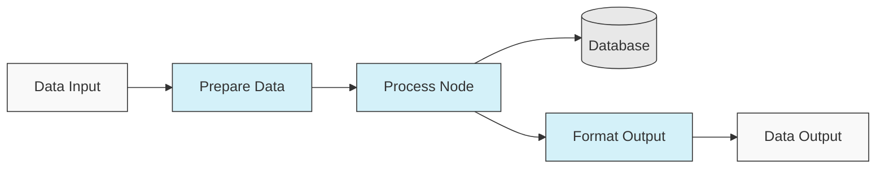
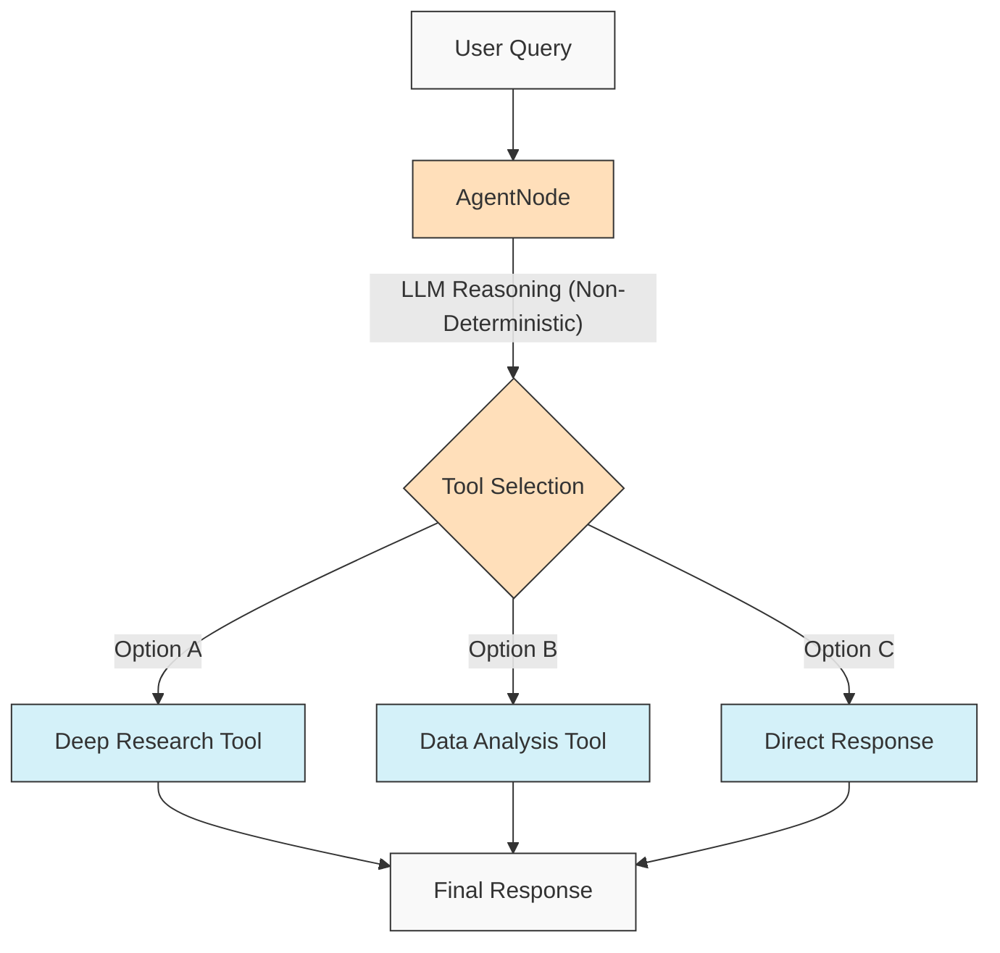
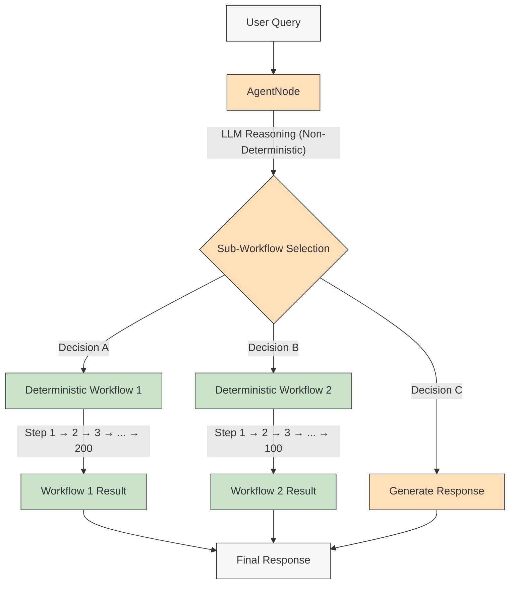

# AgentDock: Build Anything with AI Agents

AgentDock is a framework for building sophisticated AI agents that deliver complex tasks with **configurable determinism**. It consists of two main components:

1. **AgentDock Core**: An open-source, backend-first framework for building and deploying AI agents. It's designed to be *framework-agnostic* and *provider-independent*, giving you complete control over your agent's implementation.

2. **Open Source Client**: A complete Next.js application that serves as a reference implementation and consumer of the AgentDock Core framework. You can see it in action at [https://hub.agentdock.ai](https://hub.agentdock.ai)

Built with TypeScript, AgentDock emphasizes *simplicity*, *extensibility*, and ***configurable determinism*** - making it ideal for building reliable and predictable AI systems that can operate with minimal supervision.

## 🧠 Design Principles

AgentDock is built on these core principles:

- **Simplicity First**: Minimal code required to create functional agents
- **Node-Based Architecture**: All capabilities implemented as nodes
- **Tools as Specialized Nodes**: Tools extend the node system for agent capabilities
- **Configurable Determinism**: Control the predictability of agent behavior
- **Type Safety**: Comprehensive TypeScript types throughout

### Configurable Determinism

***Configurable determinism*** is a cornerstone of AgentDock's design philosophy, enabling you to balance creative AI capabilities with predictable system behavior:

- AgentNodes are inherently non-deterministic as LLMs may generate different responses each time
- Workflows can be made more deterministic through *defined tool execution paths*
- Developers can **control the level of determinism** by configuring which parts of the system use LLM inference
- Even with LLM components, the overall system behavior remains **predictable** through structured tool interactions
- This balanced approach enables both *creativity* and **reliability** in your AI applications

#### Deterministic Workflows

AgentDock allows you to create fully deterministic processing flows where the execution path and outcomes are predictable:



#### Non-Deterministic Agent Behavior

When using AgentNodes with LLMs, the specific outputs may vary, but the overall interaction patterns can be structured:



#### Non-Deterministic Agents with Deterministic Sub-Workflows

AgentDock gives you the ***best of both worlds*** by combining non-deterministic agent intelligence with deterministic workflow execution:



This approach enables complex multi-step workflows (with hundreds of deterministic steps) to be invoked by intelligent agent decisions. Each workflow executes predictably despite being triggered by non-deterministic agent reasoning.

For more advanced AI agent workflows and multi-stage processing pipelines, we're building [AgentDock Pro](docs/agentdock-pro.md) - a powerful platform for creating, visualizing, and running complex agent systems.

#### TL;DR on Configurable Determinism 

Think of it like driving. Sometimes you need the AI's creativity (like navigating city streets - non-deterministic), and sometimes you need reliable, step-by-step processes (like following highway signs - deterministic). AgentDock lets you build systems that use *both*, choosing the right approach for each part of a task. You get the AI's smarts *and* predictable results where needed.


## 🏗️ Core Architecture

The framework is built around a powerful node-based system:

- **BaseNode**: Foundation for all nodes, providing core functionality
- **AgentNode**: Specialized node for LLM-powered agents
- **Tools as Nodes**: Custom capabilities implemented as specialized nodes
- **Node Registry**: Central system for managing and connecting nodes
- **Session Management**: State isolation between concurrent conversations
- **Orchestration Framework**: Context-aware control of agent behavior

### Advanced Capabilities

| Capability | Description | Documentation |
|------------|-------------|---------------|
| **Session Management** | Isolated, performant state management for conversations | [Session Documentation](./docs/architecture/sessions/README.md) |
| **Orchestration Framework** | Control agent behavior and tool availability based on context | [Orchestration Documentation](./docs/architecture/orchestration/README.md) |

This architecture provides a consistent foundation for all capabilities while enabling extensibility through specialized node types.

## 🚀 Getting Started

For a comprehensive guide, see the [Getting Started Guide](docs/getting-started.md).

### Requirements

* Node.js ≥ 20.11.0 (LTS)
* pnpm ≥ 9.15.0 (Required)
* API keys for LLM providers (Anthropic, OpenAI, etc.)

### Installation

1. **Install pnpm**:

   ```bash
   corepack enable
   corepack prepare pnpm@latest --activate
   ```

2. **Install Dependencies**:

   ```bash
   pnpm install
   ```
   
   For a clean reinstallation (when you need to rebuild from scratch):
   ```bash
   pnpm run clean-install
   ```
   This script removes all node_modules, lock files, and reinstalls dependencies correctly.

3. **Configure Environment**:
   
   Create a `.env.local` file based on `.env.example`:
   
   ```bash
   cp .env.example .env.local
   ```
   
   Then add your API keys to the `.env.local` file.

4. **Start Development Server**:

   ```bash
   pnpm dev
   ```

## 🔐 Environment Configuration Details

The AgentDock Open Source Client requires API keys for LLM providers to function. These are configured in your `.env.local` file.

### LLM Provider API Keys

Add your LLM provider API keys (at least one is required):

```bash
# LLM Provider API Keys - at least one is required
ANTHROPIC_API_KEY=sk-ant-xxxxxxx  # Anthropic API key
OPENAI_API_KEY=sk-xxxxxxx         # OpenAI API key
GEMINI_API_KEY=xxxxxxx            # Google Gemini API key
DEEPSEEK_API_KEY=xxxxxxx          # DeepSeek API key
GROQ_API_KEY=xxxxxxx              # Groq API key
```

### API Key Resolution

The AgentDock Open Source Client follows a priority order when resolving which API key to use:

1. **Per-agent custom API key** (set via agent settings in the UI)
2. **Global settings API key** (set via the settings page in the UI)
3. **Environment variable** (from .env.local or deployment platform)

### Tool-specific API Keys

Some tools also require their own API keys:

```bash
# Tool-specific API Keys
SERPER_API_KEY=                  # Required for search functionality
FIRECRAWL_API_KEY=               # Required for deeper web search
```

For more details about environment configuration, see the implementation in [`src/types/env.ts`](src/types/env.ts).

### Using Your Own API Keys (BYOK)

AgentDock follows a BYOK (Bring Your Own Key) model:

1. Add your API keys in the settings page of the application
2. Alternatively, provide keys via request headers for direct API usage
3. Keys are securely stored using the built-in encryption system
4. No API keys are shared or stored on our servers

## 📦 Package Manager

This project *requires* the use of `pnpm` for consistent dependency management. `npm` and `yarn` are not supported.

## 💡 What You Can Build

1. **AI-Powered Applications**
   - Custom chatbots with any frontend
   - Command-line AI assistants
   - Automated data processing pipelines
   - Backend service integrations

2. **Integration Capabilities**
   - Any AI provider (OpenAI, Anthropic, etc.)
   - Any frontend framework
   - Any backend service
   - Custom data sources and APIs

3. **Automation Systems**
   - Data processing workflows
   - Document analysis pipelines
   - Automated reporting systems
   - Task automation agents

## ✨ Key Features

- 🔌 **Framework Agnostic**: AgentDock Core works with any tech stack
- 🧩 **Modular Design**: Build complex systems from simple nodes
- 🛠️ **Extensible**: Create custom nodes for any functionality
- 🔒 **Secure**: Built-in security features for API keys and data
- 🔑 **BYOK (Bring Your Own Key)**: Use your own API keys for LLM providers
- 📦 **Self-Contained**: Core framework has minimal dependencies
- ⚙️ **Multi-Step Tool Calls**: Support for complex reasoning chains
- 📊 **Structured Logging**: Detailed insights into agent execution
- 🛡️ **Robust Error Handling**: Predictable behavior and simplified debugging
- 📝 **TypeScript First**: Type safety and enhanced developer experience
- 🌐 **Reference Implementation**: Complete Next.js application included
- 🔄 **Orchestration**: Dynamic control of agent behavior based on context
- 💾 **Session Management**: Isolated state for concurrent conversations
- 🎮 **Configurable Determinism**: Precise control over agent predictability

## 🧰 Components

AgentDock's modular architecture is built upon these key components:

* **BaseNode**: The foundation for all nodes in the system
* **AgentNode**: The primary abstraction for agent functionality
* **Tools**: Functions callable by an LLM through the AgentNode
* **Node Registry**: Manages the registration and retrieval of all node types
* **Tool Registry**: Manages tool availability for agents
* **CoreLLM**: Unified interface for interacting with LLM providers
* **Provider Registry**: Manages LLM provider configurations
* **Error Handling**: System for handling errors and ensuring predictable behavior
* **Logging**: Structured logging system for monitoring and debugging
* **Orchestration**: Controls tool availability and behavior based on conversation context
* **Sessions**: Manages state isolation between concurrent conversations

For detailed technical documentation on these components, see the [Architecture Overview](docs/architecture/README.md).

## 📝 Agent Templates

AgentDock includes several pre-configured agent templates. Explore them in the `agents/` directory or read the [Agent Templates Documentation](docs/agent-templates.md) for details on configuration.

## 🔧 Example Implementations

Example implementations showcase specialized use cases and advanced functionality:

| Implementation | Description | Status |
|----------------|-------------|--------|
| **Orchestrated Agent** | Example agent using orchestration to adapt behavior based on context | Available |
| **Cognitive Reasoner** | Tackles complex problems using structured reasoning & cognitive tools | Available |
| **Agent Planner** | Specialized agent for designing and implementing other AI agents | Available |
| [**Code Playground**](docs/roadmap/code-playground.md) | Sandboxed code generation and execution with rich visualization capabilities | Planned |
| [**Generalist AI Agent**](docs/roadmap/generalist-agent.md) | Manus-like agent that can use browser and execute complex tasks | Planned |

## 💾 Storage System

AgentDock Core includes a secure storage system with ongoing development for advanced features:

*   **Current Capabilities**: Key-Value storage (Memory, Redis, Vercel KV providers), Secure client-side storage.
*   **In Development**: Vector storage, additional pluggable backends, and working memory.

See the [Storage Abstraction Layer documentation](docs/roadmap/storage-abstraction.md) for details on the storage system roadmap.

## 📂 Repository Structure

This repository contains:

1.  **AgentDock Core**: The core framework located in `agentdock-core/`
2.  **Open Source Client**: A complete reference implementation built with Next.js, serving as a consumer of the AgentDock Core framework.
3.  **Example Agents**: Ready-to-use agent configurations in the `agents/` directory

You can use AgentDock Core independently in your own applications, or use this repository as a starting point for building your own agent-powered applications.

## 🗺️ Roadmap

Below is our development roadmap for AgentDock. Most improvements listed here relate to the core AgentDock framework (`agentdock-core`), which is currently developed locally and will be published as a versioned NPM package upon reaching a stable release. Some roadmap items may also involve enhancements to the open-source client implementation.

### In Progress

| Feature | Description |
|---------|-------------|
| [**Storage Abstraction Layer**](docs/roadmap/storage-abstraction.md) | Flexible storage system with pluggable providers |
| [**Advanced Memory Systems**](docs/roadmap/advanced-memory.md) | Long-term context management |
| [**Vector Storage Integration**](docs/roadmap/vector-storage.md) | Embedding-based retrieval for documents and memory |
| [**Evaluation for AI Agents**](docs/roadmap/evaluation-framework.md) | Comprehensive testing and evaluation framework |

### Planned

| Feature | Description |
|---------|-------------|
| [**Platform Integration**](docs/roadmap/platform-integration.md) | Support for Telegram, WhatsApp, and other messaging platforms |
| [**Multi-Agent Collaboration**](docs/roadmap/multi-agent-collaboration.md) | Enable agents to work together |
| [**Model Context Protocol (MCP) Integration**](docs/roadmap/mcp-integration.md) | Support for discovering and using external tools via MCP |
| [**Voice AI Agents**](docs/roadmap/voice-agents.md) | AI agents using voice interfaces and phone numbers via AgentNode |
| [**Telemetry and Traceability**](docs/roadmap/telemetry.md) | Advanced logging and performance tracking |

### Advanced Agent Applications

| Feature | Description |
|---------|-------------|
| [**Code Playground**](docs/roadmap/code-playground.md) | Sandboxed code generation and execution with rich visualization capabilities |
| [**Generalist AI Agent**](docs/roadmap/generalist-agent.md) | Manus-like agent that can use browser and execute complex tasks |

### Cloud Deployment

| Feature | Description |
|---------|-------------|
| [**AgentDock Pro**](docs/agentdock-pro.md) | Comprehensive enterprise cloud platform for scaling AI agents & workflows, with visual tools and autoscaling |
| [**Natural Language AI Agent Builder**](docs/roadmap/nl-agent-builder.md) | Visual builder + natural language agent and workflow construction |
| [**Agent Marketplace**](docs/roadmap/agent-marketplace.md) | Monetizable agent templates |

## 👥 Contributing

We welcome contributions to AgentDock! Please see the [CONTRIBUTING.md](CONTRIBUTING.md) for detailed contribution guidelines and the `/docs/` folder for detailed documentation, including guidelines for creating custom nodes.

## 📚 Documentation

Comprehensive documentation for both AgentDock Core and the Open Source Client is available at [https://hub.agentdock.ai/docs](https://hub.agentdock.ai/docs). This documentation site includes:

- Getting started guides
- API references
- Architecture overviews
- Tutorials and examples
- Best practices

The documentation is continuously updated as new features are developed.

## 📜 License

AgentDock is released under the [MIT License](LICENSE).

## ✨ Build Anything!

AgentDock provides the foundation to build almost any AI-powered application or automation you can imagine. We encourage you to explore the framework, build innovative agents, and contribute back to the community. Let's build the future of AI interaction together!