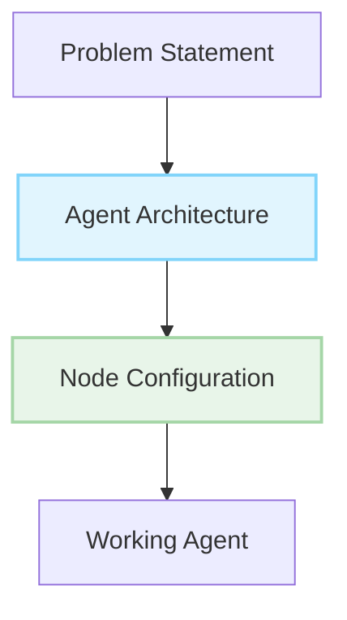
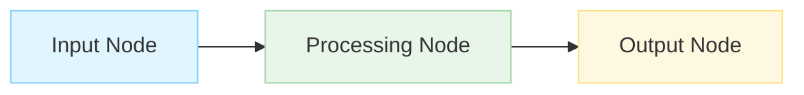

# Request For Agents (RFA)

> Build powerful AI agents with AgentDock's node-based architecture

## What are Requests For Agents?

Requests For Agents (RFAs) are specifications for AI agents that solve real-world problems using the AgentDock framework. Each RFA provides a clear problem statement, implementation guidance using AgentDock's node system, and resources to help you build an effective agent.



## Why Build These Agents?

- **Solve Real Problems**: Each agent addresses actual user needs
- **Showcase Your Skills**: Implemented agents are featured in our showcase
- **Join Our Community**: Connect with other builders
- **Get Rewarded**: Selected implementations may receive special recognition
- **Build Your Portfolio**: Create valuable systems with real-world impact

## Featured RFAs

| ID | Title | Tags | Status |
|----|-------|------|--------|
| [001](./agents/001-code-reviewer.md) | Code Reviewer | `development` `productivity` | Open |
| [002](./agents/002-research-assistant.md) | Research Assistant | `research` `knowledge` | Open |
| [003](./agents/003-content-generator.md) | Content Generator | `content` `marketing` | Open |

## How to Implement an RFA

Our agent implementation follows AgentDock's node-based architecture:



Here's a simplified implementation example for a weather agent:

```typescript
import { orchestrateAgent } from "agentdock-core";
import { ChatNode } from "../nodes/chat";
import { WeatherNode } from "../nodes/weather";

// Define nodes
const chatNode = new ChatNode({
  system: "You are a helpful weather assistant."
});

const weatherNode = new WeatherNode({
  apiKey: process.env.WEATHER_API_KEY
});

// Create agent with connections
const agent = {
  nodes: [chatNode, weatherNode],
  connections: [
    { from: chatNode, to: weatherNode },
    { from: weatherNode, to: chatNode }
  ]
};

// Orchestrate the agent
const result = await orchestrateAgent(agent, initialMessage);
```

## Submission Process

1. Fork the AgentDock repository
2. Build your agent implementation using AgentDock Core
3. Create a PR with your implementation
4. Include documentation and example usage

## Tags Used in RFAs

Our tagging system helps you find RFAs that match your interests:

| Category | Tags |
|----------|------|
| Domain | `business` `education` `finance` `health` `productivity` |
| Skill | `coding` `design` `research` `writing` `analysis` |
| Complexity | `beginner` `intermediate` `advanced` |
| Status | `open` `claimed` `implemented` |

## For Non-Developers

Not a developer? You can still create these agents without code using **AgentDock Pro** - our visual agent builder lets you implement any RFA through an intuitive drag-and-drop interface and natural language instructions.

[Learn more about AgentDock Pro →](https://agentdock.ai/pro) 