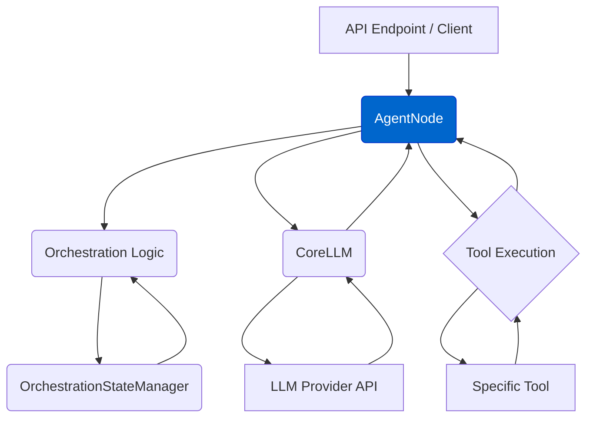
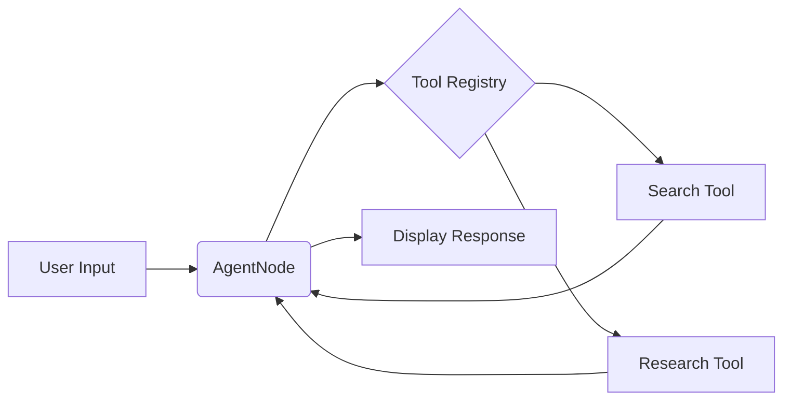

# Agent Node (`AgentNode`)

The `AgentNode` class (`agentdock-core/src/nodes/agent-node.ts`) is the primary orchestrator for conversational agent interactions within AgentDock Core. It leverages the Vercel AI SDK for efficient streaming and multi-step tool execution.

## Core Responsibilities

-   **Message Processing:** Handles incoming message arrays via its primary `handleMessage` method.
-   **LLM Interaction:** Manages communication with language models via `CoreLLM`, utilizing the Vercel AI SDK's `streamText` function for generation, streaming, and tool execution.
-   **Tool Integration:**
    -   Determines available tools based on the agent template and current orchestration state (`OrchestrationManager.getAllowedTools`).
    -   Prepares available tools (including `description`, `parameters`, and `execute` function) for `streamText`, which handles the internal tool execution loop.
-   **State Management & Orchestration:**
    -   Receives the `OrchestrationManager` and `sessionId` via `handleMessage`.
    *   Uses the manager to fetch current state and filter available tools before calling `streamText`.
    *   Updates orchestration state (`cumulativeTokenUsage`, `recentlyUsedTools`) asynchronously via the `onFinish` callback after the stream completes.
-   **Configuration:** Reads agent behavior rules (personality, nodes, model config, `maxSteps`) from the `AgentConfig` object and accepts runtime overrides.
-   **Context Injection:** Adds relevant context (like current time) to the LLM prompt (handled by prompt utils).
-   **Token Usage Coordination:** Managed through the `onFinish` callback using usage data from generation results.

## Key Interactions



1.  Receives request with messages and session ID.
2.  Consults Orchestration logic (using `OrchestrationStateManager`) to determine the active step and load relevant state.
3.  Filters available tools based on the active step and any sequence rules.
4.  Constructs the prompt using message history, system prompt, and context.
5.  Calls `CoreLLM.streamText`, passing messages, prompt, and filtered tools.
6.  If the LLM response includes a tool call:
    a.  The SDK identifies and executes the requested tool.
    b.  Tool execution might involve its own LLM calls or interact with external services.
    c.  The tool result is formatted and sent back to the LLM to continue generation.
7.  Streams the final text response back to the caller.
8.  Updates token usage and state information after the interaction completes.

## Configuration

The `AgentNode`'s behavior is primarily configured through the agent template (`template.json`), which specifies:

-   LLM provider and model.
-   System prompt and personality.
-   List of tools the agent *can* potentially use.
-   Orchestration rules (steps, conditions, tool availability per step, sequences).

## Extensibility

While `AgentNode` provides the core conversational flow, custom logic can be introduced by:

-   Creating custom tools.
-   Defining complex orchestration rules.
-   (Advanced) Potentially extending or wrapping `AgentNode` for highly specialized use cases, although customization is primarily intended through templates and tools.

## 1. Overview

The `AgentNode` handles the core agent functionality:

* Receives user input (text messages)
* Processes the input using LLMs and tools
* Generates responses (text messages)
* Integrates with the tool registry to access tools
* Supports both fallback providers for reliability
* Maintains token usage tracking
* Provides streaming responses

## 2. Functionality

The `AgentNode` provides these key capabilities:

* **Multi-Provider Support:** Works with multiple LLM providers (OpenAI, Anthropic, Google, DeepSeek, Groq)
* **Message Handling:** Processes messages and manages conversation flow
* **Tool Integration:** Retrieves tools from the tool registry and makes them available to the LLM
* **Time Context:** Automatically injects current date and time into prompts
* **Fallback Support:** Can use backup API keys when primary fails
* **Token Tracking:** Monitors token usage across providers

```typescript
// Example of AgentNode configuration
{
  "type": "AgentNode",
  "config": {
    "provider": "anthropic",
    "apiKey": "YOUR_API_KEY",
    "fallbackApiKey": "BACKUP_API_KEY", // Optional
    "agentConfig": {
      "personality": "You are a helpful assistant.",
      "nodes": ["search", "deep_research"]
    }
  }
}
```

## 3. Implementation Details

The `AgentNode` extends the `BaseNode` class and implements:

* **Node Registration:** The `AgentNode` is registered in the Node Registry
* **Tool Retrieval:** Gets tools from the tool registry based on configuration
* **Message Handling:** Processes messages and prepares them for the LLM
* **LLM Integration:** Uses the appropriate LLM provider to generate responses
* **Response Streaming:** Streams responses back to the client

### Registry Relationship

* **Node Registry:** Manages the registration and retrieval of node instances, including the `AgentNode`. It allows the system to create and manage nodes based on their type.
* **Tool Registry:** Specifically manages the tools that can be used by the `AgentNode`. The `AgentNode` retrieves tools from this registry based on its configuration.

### Tools as Specialized Nodes

In AgentDock, tools are implemented as specialized nodes:

* Tools are registered in the Node Registry with the `isTool` flag set to `true`
* The Node Registry provides metadata and versioning for tools
* The Tool Registry provides a focused interface for retrieving tools for specific agents
* This dual-registry approach supports both the current OSS implementation and the future Pro implementation

## 4. Example Usage



## Response Streaming

The `AgentNode` returns an `AgentDockStreamResult` (an enhanced version of Vercel AI SDK's `StreamTextResult`) from its `handleMessage` method. This enhanced result provides:

- **Orchestration State Tracking**: Tracks recently used tools and token usage
- **Error Handling**: Provides better error propagation from LLM providers
- **Extended Response Types**: Supports different types of response objects

For detailed information about the streaming capabilities, see [Response Streaming Documentation](./core/response-streaming.md).

```typescript
// Example: Using AgentNode with stream result
const result = await agentNode.handleMessage({
  messages,
  sessionId,
  orchestrationManager
});

// Access the stream for direct response
const response = result.toDataStreamResponse();

// Or access the token usage after completion
const usage = await result.usage;
console.log(`Total tokens: ${usage.totalTokens}`);
``` 