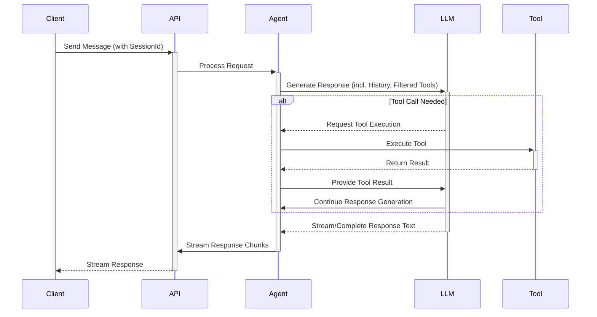

# Request Flow in AgentDock Core

This document outlines the typical sequence of events when a request (like a user message) is processed by AgentDock Core.

## Request Flow Diagram



## Detailed Steps

1.  **Request Initiation:** A client sends a request (e.g., a user message, potentially including a `sessionId` from a previous interaction) to an API endpoint.
2.  **API Endpoint Handling:**
    -   The endpoint receives the request.
    -   It extracts the `sessionId` (if present) and message payload.
    -   It determines the target `agentId`.
3.  **Agent Instantiation (`AgentNode`):**
    -   The endpoint loads the corresponding agent template (`template.json`).
    -   It creates an instance of `AgentNode`, passing the agent configuration, necessary API keys, and potentially references to core managers (like `OrchestrationStateManager`).
4.  **State Retrieval / Initialization:**
    -   `AgentNode` (or its internal orchestration logic) requests the `OrchestrationState` for the given `sessionId` from the `OrchestrationStateManager`.
    -   The `OrchestrationStateManager` uses the configured `SessionManager` which, in turn, uses the configured `StorageProvider` (e.g., Redis) to load the state. If no state exists and orchestration is configured, a default state is created and potentially persisted.
5.  **Orchestration & Tool Filtering:**
    -   The orchestration logic evaluates conditions based on the loaded state and incoming message to determine the `activeStep`.
    -   It filters the agent's configured tools based on the `activeStep`'s `availableTools` rules.
    -   It consults the `StepSequencer` (using the current `sequenceIndex` from the state) to potentially further restrict tools if a sequence is active.
6.  **LLM Interaction (`CoreLLM.streamText`):**
    -   `AgentNode` prepares the prompt (system prompt, message history, context).
    -   Crucially, it sets the token usage update handler callback on the `CoreLLM` instance.
    -   It calls `streamText`, providing the prompt and the *filtered* list of available tools.
    -   `CoreLLM` interacts with the underlying LLM provider API (via Vercel AI SDK).
7.  **Response Streaming & Tool Handling:**
    -   The LLM provider starts streaming the response (text chunks or tool call requests).
    -   **If a tool call is requested:**
        -   `CoreLLM` signals the tool call back to `AgentNode`.
        -   `AgentNode` identifies the tool, prepares inputs, and executes its `execute` method.
        -   Tool execution might involve its own `CoreLLM` calls (which report token usage via the callback) or external API calls.
        -   The tool returns its result to `AgentNode`.
        -   `AgentNode` sends the tool result back to the LLM (via another `streamText` call or similar mechanism) to allow the LLM to continue generation.
    -   **Text Generation:** Text chunks from the LLM are streamed back through `CoreLLM` and `AgentNode` to the API endpoint.
8.  **State Updates:**
    -   **Token Usage:** As `CoreLLM` receives usage information (typically at the end of a stream segment or call), it invokes the configured callback. The callback handler (usually managed by `AgentNode`) updates the `cumulativeTokenUsage` in the `OrchestrationState` via `OrchestrationStateManager`.
    -   **Tool History:** `AgentNode` calls `OrchestrationStateManager.addUsedTool`.
    -   **Sequence Index:** If a tool matching the sequence was used, `StepSequencer.processTool` (called by `AgentNode`) updates the `sequenceIndex` via `OrchestrationStateManager`.
    -   **Last Accessed:** The `lastAccessed` timestamp in the state is updated.
    -   These state updates are persisted via the Storage Provider.
9.  **Response Completion:**
    -   The stream ends.
    -   The API endpoint finishes sending the response to the client, potentially including the final `sessionId` in headers.
10. **Cleanup:** The `AgentNode` instance is typically discarded. The session state persists in the storage backend until its TTL expires and it's removed by the `SessionManager`'s cleanup process.

## Overview

**AgentDock Core** uses a structured request flow that handles everything from user input processing to response streaming. The flow is designed to be efficient, reliable, and extensible.

## AgentDock Core Flow

The core flow components are framework-agnostic and work across any implementation.

### 1. Agent Processing

```typescript
// Creating the agent instance
const agent = await createAgent(agentId, { apiKey });

// Generate response using the agent
const response = await agent.generateResponse({
  messages,
  // ...
});
```

The agent processes the message using its configured LLM.

### 2. Tool Calling

During response generation, the LLM may identify the need to call tools:

```typescript
// Tool calling in the LLM
if (chunk.tool_calls) {
  const results = await processToolCalls(chunk.tool_calls);
  // Send results back to LLM
}
```

Tools are executed based on the LLM's request, and results are provided back to the LLM.

## Next.js Reference Implementation

In the **Next.js reference implementation**, this flow is implemented using API routes:

### 1. Message Reception

```typescript
// API route receives the user message
export async function POST(req: Request) {
  const { messages, agentId } = await req.json();
  // ...
}
```

The API route receives the user's message and extracts necessary parameters.

### 2. Response Streaming

```typescript
// Stream the response back to the client
return new StreamingTextResponse(stream);
```

The response is streamed in real-time back to the user.

## Error Handling

The request flow includes comprehensive error handling:

- **Input Validation**: Ensures all required parameters are present
- **LLM Errors**: Handles errors from the LLM provider
- **Tool Errors**: Gracefully handles tool execution failures
- **API Errors**: Ensures proper HTTP status codes for different error types

## Session Management

The request flow maintains session state across requests:

- **Conversation History**: Maintains message history
- **Tool Context**: Preserves state for tools
- **User Settings**: Retains user preferences