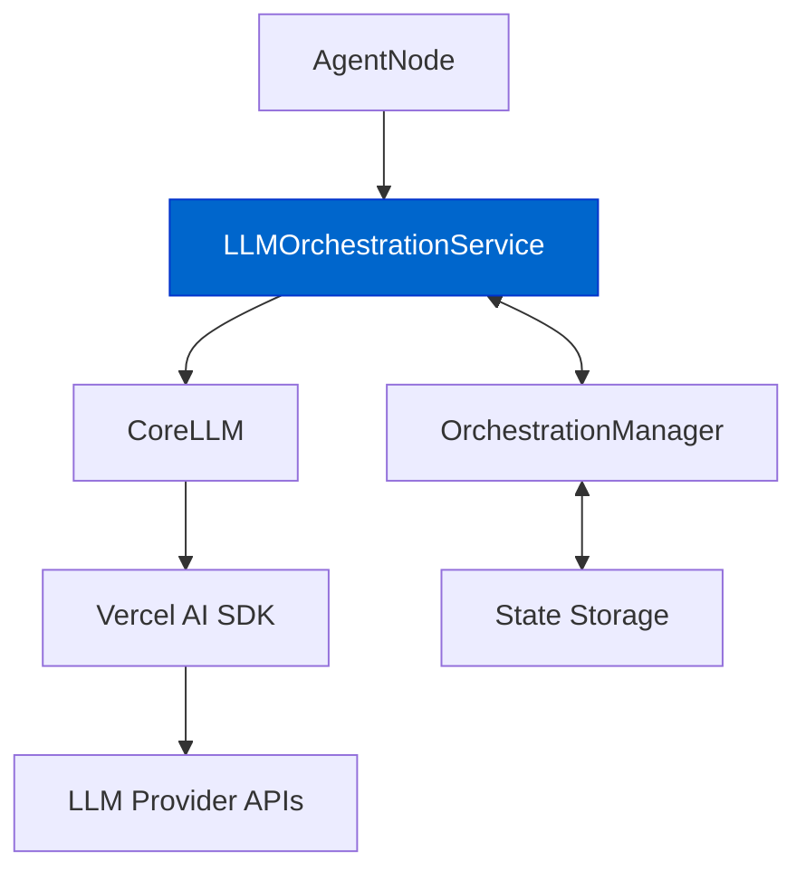

# LLM Orchestration Service

The `LLMOrchestrationService` serves as a bridge between the `AgentNode` and `CoreLLM`, adding orchestration-specific functionality to LLM interactions.

## Core Responsibilities

- **Stream Management**: Wraps CoreLLM's streaming capabilities with orchestration state
- **Token Usage Tracking**: Updates token usage in session state
- **Tool Tracking**: Monitors and records tools used during interactions
- **Callback Injection**: Provides orchestration-aware callbacks for stream events

## Architecture Position



## Key Methods

### streamWithOrchestration

The primary method that wraps `CoreLLM.streamText` with orchestration capabilities:

```typescript
async streamWithOrchestration(
  options: StreamWithOrchestrationOptions
): Promise<AgentDockStreamResult<Record<string, CoreTool>, any>>
```

This method:
1. Prepares orchestration-aware callbacks for `onFinish` and `onStepFinish`
2. Calls `CoreLLM.streamText` with these callbacks
3. Returns an enhanced stream result with orchestration state

### updateTokenUsage

A private method that updates the token usage in the session state:

```typescript
private async updateTokenUsage(usage?: TokenUsage): Promise<void>
```

This method:
1. Fetches the current state from the `OrchestrationManager`
2. Updates the cumulative token usage with the new usage information
3. Stores the updated state back in the session

## Integration with Tool Tracking

The service also tracks tools used during the conversation:
- Monitors tool calls in the `onStepFinish` callback
- Updates the `recentlyUsedTools` array in session state
- Provides this information to orchestration rules for conditional transitions

## Constructor

```typescript
constructor(
  private llm: CoreLLM,
  private orchestrationManager: OrchestrationManager,
  private sessionId: SessionId
)
```

The service requires:
- A `CoreLLM` instance for LLM interactions
- An `OrchestrationManager` for state management
- A `sessionId` to identify the session context

## Related Documentation

- [Orchestration Overview](./orchestration-overview.md) - General orchestration concepts
- [State Management](./state-management.md) - How state is managed in orchestration
- [Response Streaming](../core/response-streaming.md) - Details on streaming capabilities 