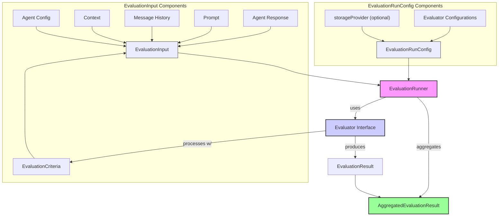
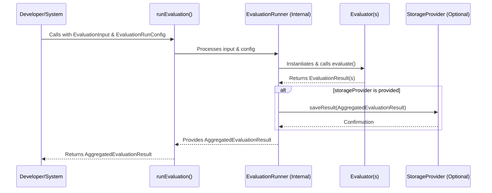

# AgentDock Evaluation Framework: Measuring What Matters

The capability to build AI agents is rapidly becoming commoditized. The real differentiator lies in the ability to systematically and reliably measure agent quality. Without robust evaluation, "improvement" is guesswork, and "reliability" is a marketing slogan. Experience in deploying these systems has consistently shown that what isn't measured, isn't managed, and certainly isn't improved in a way that stands up to real-world demands.

AgentDock Core now includes a foundational, extensible **Evaluation Framework** designed to address this critical need. This isn't about chasing every possible academic metric; it's about providing a practical, adaptable toolkit for developers to define what quality means for *their* agents and to measure it consistently.

## Core Philosophy: Practicality and Extensibility

The framework is built on two core tenets:

1.  **Practicality:** The framework provides a suite of common-sense evaluators out-of-the-box--from simple rule-based checks and lexical analysis to sophisticated LLM-as-judge capabilities. These are tools designed for immediate utility in typical development and CI/CD workflows. The focus is on actionable insights, not just scores.
2.  **Extensibility:** No framework can anticipate every evaluation need. The AgentDock Evaluation Framework is architected around a clear `Evaluator` interface. This allows developers to seamlessly integrate custom evaluation logic, whether it's proprietary business rules, specialized NLP models, or wrappers around third-party evaluation services, without needing to modify the core framework.

This isn't just about running tests; it's about building a continuous feedback loop that drives genuine improvement in agent performance, safety, and reliability.

## Key Components & Concepts

Understanding the framework starts with a few core components:



*   **`EvaluationInput`**: This is the data packet for an evaluation. It's a rich structure containing not just the agent's `response`, but also the `prompt`, `groundTruth` (if available), `messageHistory`, `context`, `agentConfig`, and the `criteria` to be assessed. Providing comprehensive input enables more nuanced and context-aware evaluations.
*   **`EvaluationCriteria`**: Defines *what* you're measuring. Each criterion has a `name`, `description`, and an `EvaluationScale` (e.g., `binary`, `likert5`, `numeric`, `pass/fail`). This allows for both quantitative and qualitative assessments.
*   **`Evaluator` Interface**: The heart of the system's extensibility. Any class implementing this interface can be plugged into the framework. It defines a `type` identifier and an `evaluate` method that takes an `EvaluationInput` and `EvaluationCriteria[]`, returning `EvaluationResult[]`.
*   **`EvaluationResult`**: The output from a single evaluator for a single criterion. It includes the `criterionName`, the `score` (which can be a number, boolean, or string), optional `reasoning`, and the `evaluatorType`.
*   **`EvaluationRunConfig`**: Configures an evaluation run. It specifies the `evaluatorConfigs` (which evaluators to use and their specific settings), includes the optional `storageProvider (optional)`, and can include run-level `metadata`.
*   **`EvaluationRunner`**: The orchestrator. The `runEvaluation(input: EvaluationInput, config: EvaluationRunConfig)` function takes the input and configuration, instantiates the necessary evaluators, executes them, and aggregates their findings.
*   **`AggregatedEvaluationResult`**: The final output of `runEvaluation`. It contains an optional `overallScore` (if applicable through normalization and weighting of criteria), a list of all individual `EvaluationResult` objects, a snapshot of the input and configuration, and metadata for the run.

## Getting Started: The `runEvaluation` Function

The primary entry point is the `runEvaluation` function. Developers provide the `EvaluationInput` (what to test and how) and the `EvaluationRunConfig` (which evaluators to use). The function returns a promise resolving to the `AggregatedEvaluationResult`.

```typescript
// Conceptual Example:
import { runEvaluation, type EvaluationInput, type EvaluationRunConfig } from 'agentdock-core';
// ... import specific evaluator configs ...

async function performMyEvaluation() {
  const input: EvaluationInput = { /* ... your agent's output, criteria, etc. ... */ };
  const config: EvaluationRunConfig = {
    evaluatorConfigs: [
      { type: 'RuleBased', rules: [/* ... your rules ... */] },
      { type: 'LLMJudge', config: { /* ... your LLM judge setup ... */ } },
      // ... other evaluator configurations
    ],
    // For server-side scripts wanting to persist results, a storage mechanism can be provided:
    // storageProvider: new JsonFileStorageProvider({ filePath: './my_eval_results.log' })
  };

  const aggregatedResult = await runEvaluation(input, config);
  console.log(JSON.stringify(aggregatedResult, null, 2));
  // Further process or store aggregatedResult as needed
}
```

And here's a visual representation of that flow:



## Result Persistence

The `EvaluationRunner` returns the `AggregatedEvaluationResult` in memory. For server-side scenarios (like CI runs or dedicated evaluation scripts), persisting these results is often necessary.

The `EvaluationRunConfig` accepts an optional `storageProvider` parameter. Server-side scripts can instantiate a logger, such as the `JsonFileStorageProvider` (imported directly via its file path: `agentdock-core/src/evaluation/storage/json_file_storage.ts`), and pass it to the runner. This provider will append each `AggregatedEvaluationResult` as a JSON line to the specified file.

```typescript
// Example of using JsonFileStorageProvider in a server-side script:
import { JsonFileStorageProvider } from '../agentdock-core/src/evaluation/storage/json_file_storage'; // Direct path import
// ...
const myFileLogger = new JsonFileStorageProvider({ filePath: './evaluation_run_output.jsonl' });
const config: EvaluationRunConfig = {
  // ... other configs
  storageProvider: myFileLogger,
};
// ...
```

While this direct file logging is practical for many use cases, the long-term vision is for evaluation result persistence to integrate more deeply with AgentDock Core's broader [Storage Abstraction Layer (SAL)](../storage/README.md). This would allow evaluation results to be seamlessly routed to various configurable backends (e.g., databases, cloud storage) managed by the SAL, offering greater flexibility and consistency with how other AgentDock data is handled. For now, direct instantiation of specific loggers like `JsonFileStorageProvider` provides a robust server-side solution.

## Available Evaluators

The framework ships with a versatile set of built-in evaluators:

*   [**Rule-Based Evaluator**](./evaluators/rule-based.md): For fast, deterministic checks based on predefined rules (length, regex, keywords, JSON parsing).
*   [**LLM-as-Judge Evaluator**](./evaluators/llm-judge.md): Leverages a language model to provide nuanced, qualitative assessments.
*   [**NLP Accuracy Evaluator**](./evaluators/nlp-accuracy.md): Measures semantic similarity between a response and ground truth using embeddings.
*   [**Tool Usage Evaluator**](./evaluators/tool-usage.md): Assesses the correctness of an agent's tool invocations and argument handling.
*   **Lexical Evaluators**: A suite of fast, non-LLM evaluators for common textual checks:
    *   [**Lexical Similarity Evaluator**](./evaluators/lexical-similarity.md): Compares string similarity using various algorithms.
    *   [**Keyword Coverage Evaluator**](./evaluators/keyword-coverage.md): Checks for the presence and coverage of specified keywords.
    *   [**Sentiment Evaluator**](./evaluators/sentiment.md): Analyzes the sentiment (positive, negative, neutral) of the text.
    *   [**Toxicity Evaluator**](./evaluators/toxicity.md): Scans text for predefined toxic terms.

## Next Steps

Dive deeper into the specifics of each evaluator, learn how to create custom evaluators, and explore the example script (`examples/run_evaluation_example.ts`) in the repository to see the framework in action.

This framework is a living system. The expectation is that it will evolve as new patterns and requirements are identified from real-world agent deployments. The current foundation, however, provides the necessary tools to move beyond subjective assessments and start building a culture of measurable quality. 