# AgentDock Memory System

> A four-layer memory architecture that gives AI agents human-like memory capabilities

The AgentDock Memory System transforms how AI agents remember, learn, and connect information across conversations. Unlike traditional stateless AI interactions, our memory system creates persistent, intelligent agents that build knowledge over time.

## What is Memory in AgentDock?

Memory in AgentDock is a **multi-layered cognitive architecture** that mirrors human memory patterns:

- **Working Memory**: Immediate conversation context (like your mental notepad)
- **Episodic Memory**: Time-ordered experiences and events (like your personal diary)  
- **Semantic Memory**: Facts, knowledge, and learned concepts (like your personal encyclopedia)
- **Procedural Memory**: Learned patterns and successful action sequences (like your muscle memory)

Each layer serves a distinct purpose and works together to create agents that truly learn and evolve.

## Message Transformation Flow

When a user sends a message to your agent, the system intelligently processes it through **four transformation paths**:

```mermaid
graph TB
    subgraph "User Input"
        A[💬 'My payment failed for order #12345, can you help?']
    end
    
    subgraph "ConversationProcessor"
        B[🧠 Message Analysis]
        C[🎯 LLM Extraction with Zod Validation]
        D[🔄 Pattern-based Fallback]
    end
    
    subgraph "Memory Storage Paths"
        E[⚡ Working Memory<br/>Recent context<br/>TTL: Session]
        F[📖 Episodic Memory<br/>'Payment failed at 2:30 PM'<br/>TTL: 30 days]
        G[💡 Semantic Memory<br/>'Order #12345 exists'<br/>TTL: Permanent]
        H[🔧 Procedural Memory<br/>'When payment fails → check order'<br/>TTL: Reinforcement-based]
    end
    
    subgraph "Memory Connections"
        I[🕸️ MemoryConnectionManager<br/>Progressive Enhancement:<br/>• Embedding similarity<br/>• User-defined rules<br/>• LLM analysis<br/>• Temporal patterns]
    end
    
    A --> B
    B --> C
    C --> D
    B --> E
    C --> F
    C --> G
    C --> H
    E --> I
    F --> I
    G --> I
    H --> I
```



## Storage Architecture

AgentDock follows a **configurable storage strategy** optimized for different environments:

```mermaid
graph TB
    subgraph "Development"
        A["🏠 SQLite + sqlite-vec<br/>Zero-configuration setup<br/>Local vector search<br/>Perfect for prototyping"]
    end
    
    subgraph "Production"
        B["🏢 PostgreSQL + pgvector<br/>Production-grade performance<br/>ACID compliance<br/>Advanced indexing"]
    end
    
    subgraph "Memory Layer"
        C[🧠 MemoryManager]
        D[📚 Memory Types]
        E[🔍 Connection Discovery]
    end
    
    subgraph "Configuration"
        F[⚙️ User Configs]
    end
    
    A --> C
    B --> C
    C --> D
    C --> E
    F --> C
```



## Key Features

### **Intelligent Extraction with Cost Optimization**
- **5x Cost Reduction**: Process only 20% of message batches (extractionRate: 0.2)
  - Example: 1000 messages → 200 processed → 80% cost savings
  - Configurable extraction rate allows fine-tuning cost vs coverage
- **Three-tier extraction strategy**: Free pattern matching → Cheap small models → Premium large models
- **Smart noise filtering**: Remove filler words and meaningless content before processing
- **LLM-powered**: Configurable AI models for extraction with Zod schema validation
- **Pattern fallback**: Regex-based extraction when LLM is unavailable or budget-constrained
- **Validated output**: Type-safe memory creation with comprehensive error handling

### **Progressive Memory Connections**
- **Embedding similarity**: Vector-based semantic relationships using configurable similarity thresholds
- **User-defined rules**: Custom pattern matching with JavaScript evaluation for domain-specific logic
- **LLM enhancement**: AI-powered relationship discovery with cost tracking and budget controls
- **Temporal patterns**: Time-based connection heuristics for episodic memory relationships
- **Progressive enhancement**: Embedding (free) → User rules (free) → LLM analysis (paid) → Heuristic fallback (free)

### **Cost-Aware Batch Processing**
- **Message buffering**: Accumulate 5-50 messages before processing for efficiency
- **Statistical processing**: Only process 1 in 5 message batches for 5x cost savings
- **Noise filtering**: Remove "ok", "thanks", "hmm" and other non-meaningful content
- **Budget controls**: Monthly spending limits and per-batch LLM call restrictions
- **Token optimization**: Compress conversations and use appropriate model tiers

### **Configurable Memory Decay**
- **Human-like forgetting**: Exponential decay with `resonance * e^(-decayRate * days)` formula
- **Access reinforcement**: Frequently accessed memories maintain higher resonance
- **Rule-based protection**: User-defined conditions to prevent critical information decay
- **Automatic cleanup**: Memories below threshold are automatically removed

### **Configuration-Driven Architecture**
- **Batch processing**: Efficient bulk operations with PostgreSQL memory adapter
- **Vector search**: Fast similarity-based retrieval with configurable distance metrics
- **User isolation**: Complete data separation with proper indexing and security
- **Flexible configuration**: Every aspect controlled through user-provided configurations

## Real-World Implementation Examples

### **Customer Support Agent**

```mermaid
sequenceDiagram
    participant Customer as 👤 Customer
    participant Agent as 🤖 Support Agent
    participant Memory as 🧠 Memory System
    participant Storage as 🗄️ Storage Layer
    
    Note over Customer, Storage: Day 1: Initial Contact
    Customer->>Agent: "My account is locked, email is john@example.com"
    Agent->>Memory: Process conversation
    Memory->>Storage: Store episodic memory: "Account lock issue"
    Memory->>Storage: Store semantic memory: "User email: john@example.com"
    Memory->>Storage: Store procedural memory: "Account lock → verify identity"
    
    Note over Customer, Storage: Day 15: Return Visit
    Customer->>Agent: "Hi, it's John again, different issue with billing"
    Agent->>Memory: Recall context for john@example.com
    Memory->>Storage: Vector search + metadata filtering
    Storage-->>Memory: Previous interactions, preferences, account details
    Memory-->>Agent: Rich context: account history, communication style
    Agent-->>Customer: "Hi John! I see you had an account issue before. How can I help with billing?"
```



### **Therapy/Coaching Agent with Memory Evolution**

```mermaid
graph LR
    subgraph "Session 1: Initial Assessment"
        A1[😰 'I get stressed before presentations']
        A2[💔 'Recently divorced']
        A3[😴 'Not sleeping well']
    end
    
    subgraph "Session 5: Progress Tracking"
        B1[😊 'I successfully presented without panic!']
        B2[🧘 'Breathing exercises really help']
        B3[🏃 'Started exercising again']
    end
    
    subgraph "Memory Connections Discovered"
        C1[🔗 Stress patterns linked to life changes]
        C2[🔗 Coping strategies that work]
        C3[🔗 Progress indicators over time]
    end
    
    subgraph "Procedural Learning"
        D1[📚 'When user reports anxiety → suggest breathing exercises']
        D2[📚 'When user mentions presentations → recall past successes']
        D3[📚 'When progress reported → reinforce positive patterns']
    end
    
    A1 --> B1
    A2 --> B2
    A3 --> B3
    B1 --> C1
    B2 --> C2
    B3 --> C3
    C1 --> D1
    C2 --> D2
    C3 --> D3
```



## Quick Start Configuration

### **1. Development Setup (SQLite + sqlite-vec)**
```typescript
import { MemoryManager, SQLiteVecAdapter } from '@agentdock/core';

// Local development with zero configuration
const storage = new SQLiteVecAdapter({
  filename: './dev-memory.db',
  enableVector: true,
  defaultDimension: 1536,
  defaultMetric: 'cosine'
});

const memoryManager = new MemoryManager(storage, {
  working: { 
    maxContextItems: 10, 
    ttlSeconds: 3600 
  },
  episodic: { 
    compressionAge: 30, 
    decayRate: 0.1 
  },
  semantic: { 
    confidenceThreshold: 0.7,
    vectorSearch: true 
  },
  procedural: { 
    learningRate: 0.05 
  }
});
```

### **2. Production Setup (PostgreSQL + pgvector)**
```typescript
import { MemoryManager, PostgreSQLVectorAdapter } from '@agentdock/core';

// Production setup with advanced features
const storage = new PostgreSQLVectorAdapter({
  connectionString: process.env.DATABASE_URL,
  schema: 'memory_system',
  enableVector: true,
  defaultDimension: 1536,
  defaultMetric: 'cosine',
  defaultIndexType: 'ivfflat',
  ivfflat: {
    lists: 100,
    probes: 10
  }
});

const memoryManager = new MemoryManager(storage, {
  working: {
    maxContextItems: 20,
    ttlSeconds: 7200  // 2 hours for production
  },
  episodic: {
    compressionAge: 90,  // Longer retention
    decayRate: 0.05      // Slower decay
  },
  semantic: {
    confidenceThreshold: 0.8,  // Higher quality bar
    consolidationEnabled: true,
    vectorSearch: true
  },
  procedural: {
    learningRate: 0.03,        // More conservative learning
    reinforcementDecay: 0.01   // Longer pattern retention
  }
});
```

### **3. Conversation Processing with Cost Controls**
```typescript
import { ConversationProcessor } from '@agentdock/core';

const processor = new ConversationProcessor(
  workingMemory, episodicMemory, semanticMemory, proceduralMemory,
  {
    llmConfig: {
      provider: 'openai',
      model: 'gpt-4o-mini',
      apiKey: process.env.OPENAI_API_KEY,
      maxTokens: 1000,
      temperature: 0.1
    },
    strategy: {
      preferLLM: true,              // Use AI when possible
      fallbackToPatterns: true,     // Graceful degradation
      tokenOptimized: true,         // Optimize for costs
      batchSize: 20                 // Process in batches
    },
    costControl: {
      monthlyBudget: 100,           // USD budget limit
      maxLLMCallsPerBatch: 5,       // Rate limiting
      preferEmbeddingWhenSimilar: true  // Skip LLM for obvious duplicates
    },
    memoryTypes: {
      enableEpisodic: true,
      enableSemantic: true,
      enableProcedural: true,
      enableWorking: true
    }
  }
);

// Process conversation with full tracking
const result = await processor.processConversation(
  'user_123', 'agent_456', 'session_789',
  [{ 
    id: 'msg_1',
    role: 'user', 
    content: 'I prefer email notifications over SMS', 
    timestamp: Date.now() 
  }]
);

console.log(`Processed ${result.messageCount} messages`);
console.log(`Created ${result.storedMemoryIds.semantic.length} semantic memories`);
console.log(`Used ${result.totalTokensUsed} tokens`);
```

### **4. Batch Processing for Cost Optimization**
```typescript
import { BatchProcessor } from '@agentdock/core';

const batchProcessor = new BatchProcessor(storage, {
  // Core batch processing settings
  maxBatchSize: 20,           // Process batches of 20 messages
  timeoutMinutes: 5,          // Or process after 5 minutes
  extractionRate: 0.2,        // Only process 20% of batches (5x cost reduction)
  
  // Noise filtering to improve extraction quality
  noiseFiltering: {
    enabled: true,
    patterns: ["^(ok|thanks?|got it)$", "^(.)\\1{2,}$"], // Remove "ok", "thanks", repeated chars
    minMessageLength: 10,     // Skip very short messages
    languageAgnostic: true    // Works with any language
  },
  
  // Three-tier extraction strategy
  extractors: [
    {
      type: 'rules',            // Tier 1: Free pattern matching
      enabled: true,
      costPerMemory: 0,
      patterns: [
        "I prefer (.+)",        // User preferences
        "My (.+) is (.+)",      // Personal information
        "I work (at|for) (.+)"  // Professional information
      ]
    },
    {
      type: 'small-llm',        // Tier 2: Cheap small models
      enabled: true,
      costPerMemory: 0.001,
      provider: 'openai',
      model: 'gpt-4o-mini'
    },
    {
      type: 'large-llm',        // Tier 3: Premium large models
      enabled: true,
      costPerMemory: 0.01,
      provider: 'openai',
      model: 'gpt-4'
    }
  ],
  
  // Cost control settings
  enableSmallModel: true,
  enablePremiumModel: true,
  costBudget: 50.0,            // Monthly budget in USD
  targetCoverage: 0.8          // Target 80% memory coverage
});

// Process messages with cost optimization
const batchResult = await batchProcessor.process(userId, agentId, messages);
console.log(`Cost: $${batchResult.cost.toFixed(4)}`);
console.log(`Coverage: ${(batchResult.coverage * 100).toFixed(1)}%`);
console.log(`Memories created: ${batchResult.memories.length}`);
```

## Memory Type Configurations

### **Working Memory (Session Context)**
```typescript
{
  maxContextItems: 10,        // Number of recent messages to keep
  ttlSeconds: 3600,          // Auto-expire after 1 hour
  contextWindow: 5,          // Rolling window for context
  priority: 'high'           // High priority for immediate access
}
```

### **Episodic Memory (Life Events)**
```typescript
{
  compressionAge: 30,        // Days before old memories compress
  decayRate: 0.1,           // Natural forgetting rate (exponential)
  retentionPolicy: 'temporal', // Time-based retention strategy
  importanceThreshold: 0.3   // Minimum importance for long-term storage
}
```

### **Semantic Memory (Knowledge Base)**
```typescript
{
  confidenceThreshold: 0.7,  // Minimum confidence for storage
  consolidationEnabled: true, // Merge similar knowledge automatically
  vectorSearch: true,        // Enable semantic similarity search
  maxRelatedFacts: 5,       // Limit related fact retrieval
  knowledgeDecay: false     // Facts don't decay by default
}
```

### **Procedural Memory (Learned Behaviors)**
```typescript
{
  learningRate: 0.05,       // How quickly patterns are learned
  reinforcementDecay: 0.02, // How patterns fade without reinforcement
  confidenceThreshold: 0.6, // Minimum confidence for recommendations
  maxPatterns: 100,         // Limit stored behavioral patterns
  successWeight: 0.8        // Weight given to successful outcomes
}
```

## Advanced Memory Decay Configuration

```typescript
{
  rules: [
    {
      id: 'critical_medical_info',
      name: 'Critical Medical Information',
      condition: "keywords.includes('allergy') || keywords.includes('medication') || importance > 0.95",
      neverDecay: true,
      enabled: true
    },
    {
      id: 'personal_preferences',
      name: 'User Preferences',
      condition: "type === 'semantic' && keywords.includes('prefer')",
      decayRate: 0.01,      // Very slow decay
      minImportance: 0.7,   // High minimum threshold
      enabled: true
    },
    {
      id: 'casual_conversations',
      name: 'Casual Chat',
      condition: "daysSinceCreated() > 7 && importance < 0.3 && !keywords.includes('important')",
      decayRate: 0.3,       // Faster decay for casual content
      minImportance: 0.1,
      enabled: true
    },
    {
      id: 'successful_procedures',
      name: 'Successful Behavioral Patterns',
      condition: "type === 'procedural' && metadata.successRate > 0.8",
      decayRate: 0.02,      // Slow decay for proven patterns
      reinforcement: true,  // Strengthen with each success
      enabled: true
    }
  ],
  defaultDecayRate: 0.05,   // Default for memories not matching any rule
  deleteThreshold: 0.01,    // Auto-delete memories below this resonance
  verbose: true             // Log decay operations for monitoring
}
```

## Memory Connection Types

The system automatically discovers relationships using **progressive enhancement**:

### **Memory Connections: The Heart of Understanding**

*This is where the magic happens - where separate memories become wisdom.*

```mermaid
graph TB
    subgraph "💝 How Memories Connect (Like Someone Who Truly Knows You)"
        A[😔 'I've been feeling anxious about the presentation']
        B[💤 'I haven't been sleeping well lately']
        C[💔 'My mom had another episode last week']
        D[🏃‍♀️ 'I used to go for runs when I felt like this']
        E[👥 'The team meeting is tomorrow']
        F[🧘‍♀️ 'That meditation app helped before']
        
        A -.->|emotional_state| C
        A -.->|physical_symptom| B
        B -.->|root_cause| C
        A -.->|previous_coping| D
        A -.->|previous_solution| F
        E -.->|stress_trigger| A
        D -.->|healthy_pattern| F
    end
    
    subgraph "🤗 How AI Uses These Connections"
        G[🤖 AI thinks:<br/>'You're anxious and not sleeping well<br/>since your mom's episode. Running and<br/>meditation helped before. With tomorrow's<br/>team meeting, you need support now.']
        
        H[💬 AI responds:<br/>'I can hear the anxiety in what you're saying,<br/>and I know your mom's situation has been weighing<br/>on you. Remember how much that morning run<br/>helped you feel centered? With your big presentation<br/>tomorrow, maybe we could plan something that<br/>helps you feel grounded tonight?']
    end
    
    A --> G
    B --> G
    C --> G
    D --> G
    E --> G
    F --> G
    G --> H
```



### **Real Example: How AI Understanding Deepens Over Time**

Marcus is a software engineer dealing with work stress and relationship challenges. Watch how his AI companion's understanding deepens over 6 months through memory connections:

```mermaid
graph TB
    subgraph "Month 1: Separate Memories (Like Meeting Someone New)"
        M1[💻 'Deadline stress at work']
        M2[💔 'Girlfriend seems distant']
        M3[😰 'Not sleeping well']
        M4[🏠 'Parents visiting next week']
    end
    
    subgraph "Month 3: Patterns Emerge (Like a Friend Getting to Know You)"
        P1[🔗 Work stress + Sleep issues = Performance anxiety cycle]
        P2[🔗 Relationship distance + Parent visits = Family pressure feelings]
        P3[🔗 All stress peaks before family events]
    end
    
    subgraph "Month 6: Deep Understanding (Like a Close Friend)"
        D1[💡 'Marcus needs validation before family events']
        D2[💡 'His girlfriend withdraws when he's stressed - not personal']
        D3[💡 'Sleep routine is his foundation - everything crumbles without it']
        D4[💡 'He processes stress by talking it through, not immediate solutions']
    end
    
    subgraph "🤖 AI's Response Evolution"
        R1[Week 1: 'That sounds stressful']
        R2[Month 3: 'I notice this pattern with family visits...']
        R3[Month 6: 'Your parents visit in 2 weeks. How are you and Lisa doing? And have you been keeping up with your evening routine? I know how much that anchors you.']
    end
    
    M1 --> P1
    M2 --> P2
    M3 --> P1
    M4 --> P2
    
    P1 --> D1
    P2 --> D2
    P1 --> D3
    P3 --> D4
    
    D1 --> R3
    D2 --> R3
    D3 --> R3
    D4 --> R3
```



### **Connection Discovery Pipeline**

```mermaid
graph TB
    subgraph "Level 1: Always Computed (Free)"
        A[📊 Embedding Similarity<br/>Vector cosine distance<br/>Configurable threshold]
    end
    
    subgraph "Level 2: User Rules (Free)"
        B[📝 Pattern Matching<br/>JavaScript evaluation<br/>Domain-specific logic]
    end
    
    subgraph "Level 3: LLM Analysis (Paid)"
        C[🧠 AI Relationship Discovery<br/>With budget controls<br/>Zod validation]
    end
    
    subgraph "Level 4: Heuristic Fallback (Free)"
        D[⏰ Temporal Patterns<br/>Time-based connections<br/>Similarity + timing]
    end
    
    A --> B
    B --> C
    C --> D
    B --> D
```


### **Connection Types That Create Understanding**

| Connection Type | What It Means in Real Life | Marcus Example |
|----------------|---------------------------|-----------------|
| `similar` | Semantically related content | "Work stress" ↔ "Family pressure" (both create the same overwhelm) |
| `causal` | One thing leads to another | "Poor sleep" → "Can't handle girlfriend's moods" |
| `temporal` | Related by time sequence | "Before big events" ≈ "Before family visits" ≈ "Before work presentations" |
| `references` | Explicit mentions or callbacks | "As we discussed yesterday about your sleep routine..." |
| `contradicts` | Conflicting information | "I love spicy food" vs "I can't handle spice" |
| `extends` | One builds upon another | Basic coping strategy → Advanced emotional regulation |
| `derived` | One derived from another | General stress → Specific family pressure pattern |
| `corrects` | One corrects another | "I'm broken" → "I'm learning my patterns" |
| `updates` | One updates another | "I can't handle this" → "I have tools for this now" |

### **Real Conversation: See the Connections in Action**

**Month 1 (No Connections):**
> **Marcus**: "Lisa's being weird again. Not sure what's up."
> 
> **AI**: "That must be frustrating. How are you feeling about it?"

**Month 6 (Deep Connections):**
> **Marcus**: "Lisa's being weird again. Not sure what's up."
> 
> **AI**: "I remember this pattern, Marcus. Last time Lisa seemed distant, you were in the middle of that big project crunch, and you mentioned you'd been pretty intense. Your parents are visiting next week too, right? I know that family stress sometimes shows up in how you interact with Lisa. Want to talk through what's been on your mind lately?"

## Deployment Configurations

### **SQLite-vec for Development**
```bash
# Install sqlite-vec extension (one-time setup)
# For macOS with Homebrew:
brew install sqlite-utils
sqlite-utils install sqlite-vec

# For manual installation:
# Download from: https://github.com/asg017/sqlite-vec
```

```typescript
// Development configuration
const devConfig = {
  storage: {
    type: 'sqlite-vec',
    filename: './memory.db',
    enableVector: true,
    // Extension auto-loads if installed in system
    vecExtensionPath: undefined  // Auto-detect
  },
  memory: {
    working: { maxContextItems: 5, ttlSeconds: 1800 },
    semantic: { confidenceThreshold: 0.6 },
    // Relaxed settings for development
  }
};
```

### **PostgreSQL + pgvector for Production**
```sql
-- Production database setup
CREATE EXTENSION IF NOT EXISTS vector;
CREATE SCHEMA IF NOT EXISTS memory_system;

-- Create optimized indexes for production
CREATE INDEX CONCURRENTLY IF NOT EXISTS idx_memories_user_agent 
ON memory_system.memories(user_id, agent_id);

CREATE INDEX CONCURRENTLY IF NOT EXISTS idx_memories_type_importance 
ON memory_system.memories(type, importance DESC);

CREATE INDEX CONCURRENTLY IF NOT EXISTS idx_memories_vector_cosine 
ON memory_system.memories USING ivfflat (embedding vector_cosine_ops) 
WITH (lists = 100);
```

```typescript
// Production configuration
const productionConfig = {
  storage: {
    type: 'postgresql-vector',
    connectionString: process.env.DATABASE_URL,
    schema: 'memory_system',
    pool: {
      min: 2,
      max: 10,
      idleTimeoutMillis: 30000
    },
    vector: {
      defaultDimension: 1536,
      defaultMetric: 'cosine',
      defaultIndexType: 'ivfflat',
      ivfflat: { lists: 100, probes: 10 }
    }
  },
  memory: {
    working: { maxContextItems: 20, ttlSeconds: 7200 },
    episodic: { compressionAge: 90, decayRate: 0.05 },
    semantic: { confidenceThreshold: 0.8, vectorSearch: true },
    procedural: { learningRate: 0.03 }
  }
};
```

## Privacy and Security

### **User Isolation**
- **Database-level separation**: User ID indexes provide data isolation per user
- **Memory operations validation**: All operations require valid userId parameter
- **Session scoping**: Working memory isolated by session ID
- **Agent-specific storage**: Memories scoped to specific agent interactions

### **Data Protection Notes**
- **PostgreSQL encryption**: When using PostgreSQL, field-level encryption is available via the pgcrypto extension (see EncryptionService)
- **Client-side storage**: SecureStorage provides AES-GCM encryption for browser storage, but has known XSS vulnerabilities (documented in security audit)
- **Memory decay**: Configurable automatic cleanup of old memories based on resonance scores
- **Access patterns**: Memory access tracking for resonance calculations

**Important Security Notice**: This is an open-source memory framework. Users are responsible for:
- Securing their deployment environment
- Managing API keys and database credentials
- Implementing additional security measures as needed for their use case
- Regular security audits of their specific implementation

For production deployments, consider:
- Using environment variables for sensitive configuration
- Implementing proper network security and firewalls
- Regular security updates and monitoring
- Following your organization's security policies

## Performance Optimizations

### **Vector Search Performance**
```typescript
// PostgreSQL production optimizations
{
  vector: {
    indexType: 'ivfflat',      // or 'hnsw' for larger datasets
    lists: 100,               // Balance between speed and accuracy
    probes: 10                // Runtime search parameter
  },
  search: {
    similarityThreshold: 0.7,  // Skip low-similarity results
    maxResults: 20,           // Limit result sets
    enableCache: true         // Cache frequent searches
  }
}

// SQLite development optimizations
{
  vector: {
    metric: 'cosine',         // Fastest for most use cases
    defaultDimension: 1536    // Match your embedding model
  },
  performance: {
    batchSize: 100,          // Batch inserts for efficiency
    connectionPool: false,   // Single connection for SQLite
    enableWAL: true         // Write-Ahead Logging for concurrency
  }
}
```

## Memory System Architecture Philosophy

Following AgentDock's core principle of **configurable determinism**, the memory system provides:

- **Deterministic retrieval**: Consistent memory recall based on configured parameters
- **Intelligent processing**: AI-powered extraction with fallback mechanisms  
- **User-controlled behavior**: Every aspect configurable through user-provided settings
- **Predictable costs**: Budget controls and cost tracking throughout the system
- **Graceful degradation**: System continues functioning even when AI services are unavailable

This approach aims to provide reliable memory behavior while maintaining the flexibility to leverage AI capabilities where beneficial.

## ⚠️ **Security & Production Considerations**

**IMPORTANT**: This is an open-source memory framework. Users are responsible for:

### **Known Security Limitations**
- Client-side SecureStorage has documented XSS vulnerabilities
- Field-level encryption requires manual pgcrypto setup for PostgreSQL  
- API keys must be secured through environment variables

### **Production Requirements**
- Implement authentication/authorization at application layer
- Use HTTPS for all API communications
- Database-level access controls and monitoring
- Regular security audits of your implementation

### **Best Practices**
Due to the highly configurable nature of this system, **best results come from official AgentDock implementations or proven community configurations** rather than custom setups.

---

**The AgentDock Memory System provides configurable memory capabilities that transform AI agents from stateless tools into intelligent, learning companions with human-like memory patterns.**