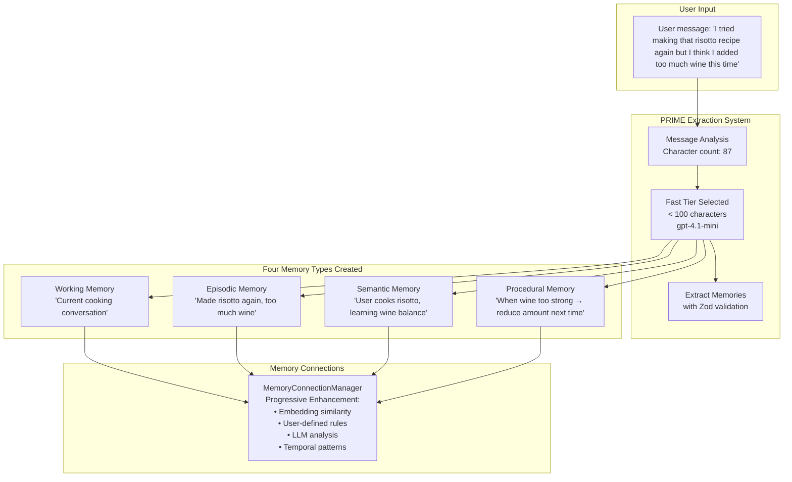
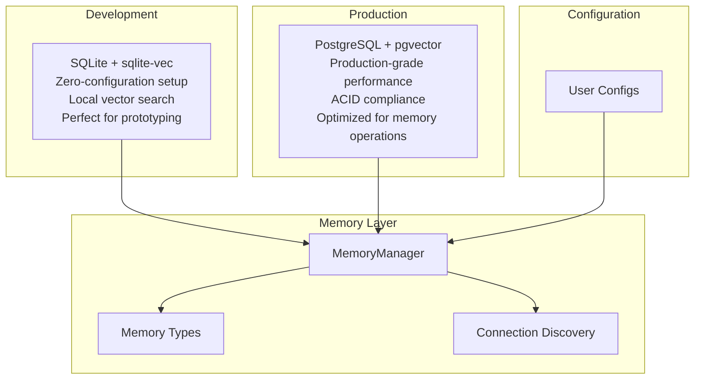

# AgentDock Memory System

> A four-layer memory architecture that gives AI agents human-like memory capabilities

The AgentDock Memory System transforms how AI agents remember, learn, and connect information across conversations. Unlike traditional stateless AI interactions, our memory system creates persistent, intelligent agents that build knowledge over time through **Conversational Retrieval-Augmented Generation (RAG)** - dynamically retrieving and injecting relevant memories into agent responses.

## Key Technical Innovations

AgentDock introduces potentially revolutionary approaches to conversational memory:

- **Four-Dimensional Memory Fusion**: Combines vector + text + temporal + procedural relevance scoring (beyond typical vector-only RAG systems)
- **PRIME Extraction System**: Cost-optimized intelligent memory extraction with automatic model tier selection  
- **Hybrid SQL + In-Memory Graph**: Graph-like memory connections without dedicated graph database complexity
- **Research-Validated Hybrid Search**: 30% text + 70% vector configuration prevents catastrophic failures on specialized domains
- **Progressive Memory Connections**: Multi-tier relationship discovery that scales from embedding similarity to LLM analysis

These innovations work together to create conversational agents that truly learn and evolve while remaining operationally simple for production deployment.

## What is Memory in AgentDock?

Memory in AgentDock is a **multi-layered cognitive architecture** that mirrors human memory patterns:

- **Working Memory**: Immediate conversation context (like your mental notepad)
- **Episodic Memory**: Time-ordered experiences and events (like your personal diary)  
- **Semantic Memory**: Facts, knowledge, and learned concepts (like your personal encyclopedia)
- **Procedural Memory**: Learned patterns and successful action sequences (like your muscle memory)

Each layer serves a distinct purpose and works together to create agents that truly learn and evolve.

## Current Implementation Status

| Component | Status | Notes |
|-----------|--------|-------|
| Four-Layer Memory Architecture | Implemented | Working, Episodic, Semantic, Procedural |
| PRIME Extraction System | Implemented | Intelligent tier selection with cost controls |
| Hybrid Search (30-70 split) | Implemented | PostgreSQL and SQLite adapters |
| Memory Connections | Implemented | Progressive enhancement approach |
| Preset Configurations | Implemented | Default, Precision, Performance, Research |
| Memory Decay System | Implemented | Configurable rules with exponential decay |
| Migration Tools | Planned | Future release |

## How AgentDock Memory Works

When a user sends a message to your agent, the **PRIME (Priority Rules Intelligent Memory Extraction)** system intelligently processes it:



**The Four-Layer Architecture** ensures each type of information is stored optimally:
- **Working Memory** maintains conversation context
- **Episodic Memory** preserves the specific experience  
- **Semantic Memory** extracts general knowledge
- **Procedural Memory** learns patterns for future recommendations

See [Architecture Overview](./architecture-overview.md) for complete technical details.

## Storage Architecture

AgentDock follows a **configurable storage strategy** optimized for different environments:

### **Why SQL + In-Memory Instead of Graph Databases?**

AgentDock deliberately uses a **hybrid SQL + in-memory graph approach** rather than dedicated graph databases (Neo4j, ArangoDB). This architectural decision provides graph-like functionality while maintaining operational simplicity:

- **No additional infrastructure** - Works with your existing PostgreSQL or SQLite database
- **Optimized for agent scale** - Perfect for 100-10,000 memories per agent (not billions like social networks)
- **Fast common queries** - Most agent queries are 1-3 hops, where SQL performs excellently
- **Operational simplicity** - Standard backup, monitoring, and deployment procedures

For the complete technical analysis of this decision, see [Graph Architecture Deep-Dive](./graph-architecture.md).



## Core Features

### **Research-Based Design**
Based on 50+ years of cognitive science research, AgentDock implements proven memory principles:
- **Spreading Activation**: Related memories activate automatically  
- **Episodic-Semantic Interdependence**: Experiences become general knowledge over time
- **Connection Types**: Grounded in semantic network theory (similar, causal, temporal, hierarchical)

See [Research Foundations](./research-foundations.md) for scientific background.

### **PRIME Extraction System**
Intelligent, cost-optimized memory extraction:
- **Character-based tier selection**: Automatically routes to optimal model (fast/balanced/accurate)
- **Budget controls**: Monthly spending limits and usage tracking
- **Validated output**: Type-safe memory creation with Zod schema validation
- **Graceful degradation**: Falls back to pattern-based extraction when needed

### **Progressive Memory Connections**
Multi-tier relationship discovery that balances cost and capability:
1. **Embedding similarity**: Vector-based semantic relationships
2. **User-defined rules**: Custom pattern matching for domain logic  
3. **LLM enhancement** (optional): AI-powered deep relationship analysis
4. **Temporal patterns**: Time-based connection heuristics

Uses hybrid SQL + in-memory graph approach for simplicity without sacrificing functionality.
See [Memory Connections Guide](./memory-connections.md) for details and [Graph Architecture](./graph-architecture.md) for technical implementation.

### **Conversational RAG**
Infrastructure-level retrieval-augmented generation:
- **Hybrid search**: Research-validated 30% text + 70% vector prevents failure modes
- **Four-dimensional fusion**: Vector + text + temporal + procedural relevance scoring
- **Automatic injection**: Agent runtime integration without manual prompt construction

See [Conversational RAG Guide](./retrieval-augmented-generation.md) for complete implementation details.

### **Memory Recall Presets**
Ready-made configurations for different agent types:
- **Default**: Balanced for general-purpose applications
- **Precision**: Exact terminology for medical/legal/financial agents  
- **Performance**: Optimized for high-volume customer support
- **Research**: Enhanced connection discovery for analysis and content discovery

### **Production-Ready Architecture**
- **Configurable memory decay**: Human-like forgetting with rule-based protection
- **Multiple storage adapters**: PostgreSQL, SQLite, ChromaDB, Pinecone, Qdrant
- **User isolation**: Complete data separation with proper security
- **Cost tracking**: Built-in monitoring and budget controls

See [Architecture Overview](./architecture-overview.md) for complete technical reference.

## Use Cases

AgentDock memory enables agents that learn and evolve across conversations:

### **Customer Support Evolution**
**Day 1**: Customer reports account lock issue  
**Day 15**: "Hi, it's John again, different issue with billing"  
**Agent Response**: "Hi John! I see you had an account issue before. How can I help with billing?"

The agent recalls previous interactions, communication preferences, and successful resolution patterns.

### **Coaching Agent Development**  
**Session 1**: User reports stress, sleep issues, recent divorce  
**Session 5**: User shares presentation success and exercise progress  
**Agent Learning**: Connects stress patterns to life changes, identifies effective coping strategies, reinforces positive behaviors

**Procedural Memory Development**:
- When user reports anxiety → suggest proven breathing exercises
- When presentations mentioned → recall past successes  
- When progress reported → reinforce positive patterns

### **Research Assistant Growth**
**Month 1**: Tracks literature on specific topics  
**Month 3**: Identifies patterns across research domains  
**Month 6**: Suggests novel connections and research directions based on accumulated knowledge

See detailed implementation examples in [Architecture Overview](./architecture-overview.md).

## Quick Start

### **Simple Setup with Presets**
```typescript
import { createMemorySystem } from '@agentdock/core';

// Development setup
const memory = await createMemorySystem({
  environment: 'local'
});

// Production with preset optimization
const memory = await createMemorySystem({
  environment: 'production',
  recallPreset: 'precision',        // For medical/legal/financial
  databaseUrl: process.env.DATABASE_URL
});

// Three integration approaches:
// 1. Direct storage: memory.store(userId, content, type)
// 2. Message processing: memory.addMessage(userId, message)  
// 3. Batch conversation analysis: Use PRIME extraction system
import { PRIMEExtractor, PRIMEOrchestrator } from 'agentdock-core';

// Historical memory injection with timestamps
const memoryId = await memoryManager.store(
  'user-123',
  'agent-456',
  'User completed onboarding last year',
  'episodic',
  { timestamp: Date.now() - (365 * 24 * 60 * 60 * 1000) }
);
```

### **Storage Options**
- **Development**: SQLite + sqlite-vec (zero configuration)
- **Production**: PostgreSQL + pgvector (managed service compatible)
- **Alternative**: ChromaDB, Pinecone, Qdrant adapters available

### **Memory Recall Presets**
- **Default**: Balanced for general use
- **Precision**: Exact terminology (medical, legal, financial)
- **Performance**: High-volume customer support  
- **Research**: Enhanced connection discovery

See [Implementation Guide](./implementation-guide.md) for complete integration examples and [Architecture Overview](./architecture-overview.md) for detailed configuration examples and deployment guides.

## Memory Architecture Details

### **Four-Layer Memory System**
- **Working Memory**: Recent conversation context (immediate access, TTL-based)
- **Episodic Memory**: Time-ordered experiences with temporal decay
- **Semantic Memory**: Knowledge and facts with confidence scoring  
- **Procedural Memory**: Learned patterns with reinforcement-based evolution

Each layer has specific configuration options for retention, decay rates, confidence thresholds, and learning parameters.

See [Architecture Overview](./architecture-overview.md) for complete configuration reference.

## Memory Lifecycle Management

**Configurable Memory Decay**: Human-like forgetting with exponential decay formula
- **Rule-based protection**: Prevent critical information from decaying
- **Access reinforcement**: Frequently recalled memories stay strong
- **Automatic cleanup**: Remove memories below relevance threshold
- **Custom rules**: Define domain-specific retention policies

Example rules: Never decay medical allergies, slow decay for user preferences, faster decay for casual conversations.

See [Architecture Overview](./architecture-overview.md) for complete decay configuration examples.

## Memory Connections

**Progressive relationship discovery** that potentially revolutionizes how agents understand context:

### **Connection Types**
- **Similar**: Semantically related content (stress patterns, topic clustering)
- **Causal**: One thing leads to another (actions → outcomes)  
- **Temporal**: Time-based relationships (events before/after patterns)
- **References**: Explicit mentions and callbacks
- **Hierarchical**: Part-of relationships (details → concepts)

### **Discovery Process**
1. **Embedding similarity**: Vector-based semantic relationships
2. **User-defined rules**: Custom pattern matching for domain logic
3. **LLM analysis** (optional): AI-powered deep relationship discovery  
4. **Temporal patterns**: Time-based connection heuristics

### **Real-World Impact**
**Month 1**: Agent handles individual queries  
**Month 6**: "I remember this pattern... Your parents visit in 2 weeks. How are you and Lisa doing? I know family stress affects how you interact."

The agent learns to connect stress patterns, relationship dynamics, and temporal cues for contextual understanding.

See [Memory Connections Guide](./memory-connections.md) for detailed examples and [Graph Architecture](./graph-architecture.md) for technical implementation.

## Production Deployment

### **Development Setup**
- **SQLite + sqlite-vec**: Zero-configuration local development
- **Automatic vector search**: Built-in embedding support
- **Simple installation**: Works with existing SQLite tooling

### **Production Setup**  
- **PostgreSQL + pgvector**: Enterprise-grade vector search
- **Managed service compatible**: Works with RDS, Supabase, Neon
- **Optimized indexing**: IVFFlat and HNSW support for large datasets
- **Connection pooling**: Efficient resource management

See [Architecture Overview](./architecture-overview.md) for complete deployment guides, database setup instructions, and production optimization examples.

## Security and Performance

### **Data Protection**
- **User isolation**: Complete data separation with database-level user ID constraints
- **Session scoping**: Working memory isolated by session ID
- **Configurable encryption**: PostgreSQL field-level encryption support
- **Memory decay**: Automatic cleanup of old memories based on relevance thresholds

### **Performance Characteristics**
- **Retrieval speed**: Sub-100ms for typical queries (100-10,000 memories per user)
- **Vector search**: Optimized with configurable similarity thresholds
- **Caching**: Built-in result caching with configurable TTL
- **Batch processing**: Efficient bulk operations for large conversations

### **Production Considerations**
This is an open-source framework. Users are responsible for:
- Authentication and authorization implementation
- API key and database credential security  
- Network security and access controls
- Regular security audits and monitoring

### **Architecture Philosophy**
**Configurable Determinism**: Reliable, predictable behavior with intelligent fallbacks
- Consistent memory recall based on configured parameters
- AI-powered processing with pattern-based fallbacks
- User-controlled behavior through comprehensive configuration
- Cost tracking and budget controls throughout the system

---

## Documentation Navigation

- **[Implementation Guide](./implementation-guide.md)** - **START HERE** - When, how, and where to integrate memory in your application
- **[Architecture Overview](./architecture-overview.md)** - Complete technical reference and configuration examples
- **[Conversational RAG](./retrieval-augmented-generation.md)** - RAG implementation and hybrid retrieval strategy  
- **[Memory Connections](./memory-connections.md)** - How memories connect and discover relationships
- **[Graph Architecture](./graph-architecture.md)** - Technical implementation of connection system
- **[Research Foundations](./research-foundations.md)** - Scientific background and cognitive science principles

---

**The AgentDock Memory System transforms AI agents from stateless tools into intelligent, learning companions with human-like memory capabilities.**