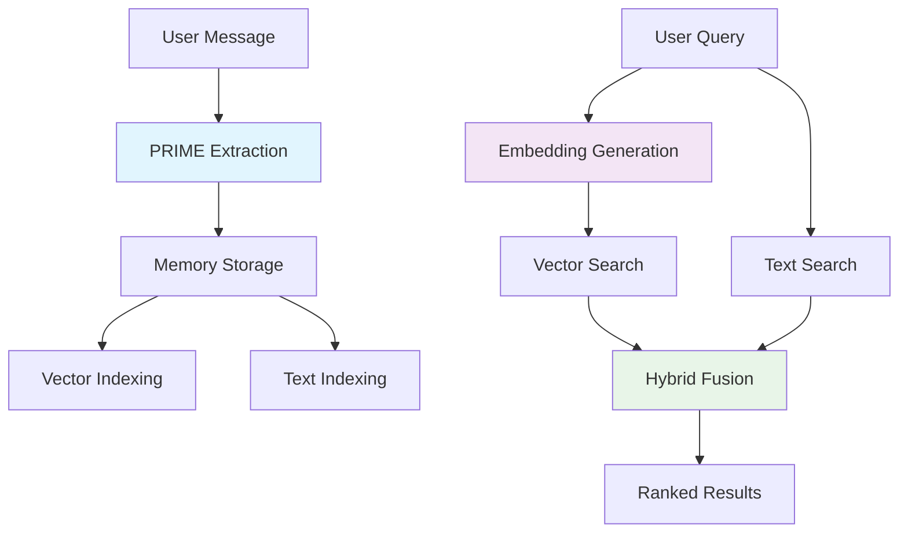

# AgentDock Memory Architecture Overview

> See also: [Memory System README](./README.md) | [Memory Connections](./memory-connections.md) | [Graph Architecture](./graph-architecture.md)

## Core Components

```
┌─────────────────┐    ┌─────────────────┐    ┌─────────────────┐
│   Conversation  │    │     PRIME       │    │ Memory System   │
│    Messages     │───▶│   Extraction    │───▶│ Storage & Search│
└─────────────────┘    └─────────────────┘    └─────────────────┘
```

## PRIME: Intelligent Memory Extraction

**Purpose**: Transform conversations into structured memories

```
Raw Message: "I met Sarah at the coffee shop, she mentioned the project deadline is Friday"

                              ▼ PRIME Extraction

Extracted Memories:
├─ Person: "Sarah" (Semantic)
├─ Location: "coffee shop" (Episodic)  
└─ Deadline: "project due Friday" (Procedural)
```

**Key Features**:
- Smart model selection (fast/balanced/accurate)
- Rule-based extraction guidance
- Cost optimization with budget tracking
- Real-time message processing

## Memory System: Vector-First Storage & Retrieval

**Purpose**: Store, index, and retrieve memories efficiently

```
Query: "What did Sarah say about deadlines?"

                              ▼ Vector + Text Search

Memory Storage:
┌─────────────┬─────────────┬─────────────┐
│  Embeddings │    FTS5     │   Metadata  │
│   [0.1,0.2] │  "deadline" │   semantic  │
│   [0.3,0.4] │   "friday"  │   episodic  │
└─────────────┴─────────────┴─────────────┘

                              ▼ Hybrid Scoring (70% vector + 30% text)

Results: [Sarah deadline memory, related project memories...]
```

**Key Features**:
- Hybrid vector + text search
- Specialized memory adapters for PostgreSQL and SQLite
- Community-extensible adapters available for ChromaDB, Pinecone, and Qdrant
- Memory type specialization
- Performance: <50ms recall

## Architecture Flow



## Advanced Features

### PRIME Extraction
- **Rule-based guidance**: Natural language extraction rules
- **Tier optimization**: Auto-select model based on complexity
- **Cost intelligence**: Budget tracking with <$20/month for 100k operations

### Memory Retrieval  
- **Vector-first**: Semantic similarity using text-embedding-3-small
- **Hybrid search**: Combines vector (70%) + text (30%) scoring
- **Multi-adapter**: PostgreSQL ts_rank_cd + SQLite FTS5 BM25
- **Performance**: <50ms recall, >95% accuracy

## Competitive Advantages

| Feature | AgentDock | Competitors |
|---------|-----------|-------------|
| Extraction Intelligence | PRIME with rules | Basic LLM |
| Storage Architecture | Hybrid vector+relational | Vector-only |
| Adapter Support | 5 adapters | 1-2 adapters |
| Managed Service Compatibility | ✅ No extensions | ❌ Requires extensions |
| Cost Optimization | Built-in tracking | External |

## Memory Connections: Graph-like Knowledge

**Purpose**: Automatically discover and maintain relationships between memories

**Key Features**:
- Progressive enhancement: embedding → user rules → LLM analysis
- Hybrid SQL + in-memory graph approach (no dedicated graph database needed)
- Temporal pattern recognition for time-based connections
- Research-based connection types (similar, causal, hierarchical)

See [Memory Connections](./memory-connections.md) for detailed explanation and [Graph Architecture](./graph-architecture.md) for technical implementation.

## Memory Lifecycle & Decay

AgentDock implements a **lazy memory decay** system to simulate human-like forgetting, ensuring that agent memory remains relevant without manual cleanup. This system is efficient, operating on-demand when memories are accessed, which avoids costly batch processing jobs.

### Configuration

Decay behavior is controlled through the `LazyDecayConfig` object during memory system initialization.

```typescript
// Example configuration for lazy decay
const lazyDecayConfig = {
  // The time (in days) it takes for a memory's relevance to halve.
  defaultHalfLife: 30,
  
  // Resonance score below which a memory is considered irrelevant and can be archived.
  archivalThreshold: 0.1,
  
  // Whether to increase the resonance of a memory when it's accessed.
  enableReinforcement: true,
  
  // The factor by which to boost resonance on access (e.g., 0.1 = 10% boost).
  reinforcementFactor: 0.1, 
  
  // The maximum resonance a memory can reach through reinforcement.
  maxResonance: 2.0,
  
  // Minimum time (in ms) before a memory can be updated again to avoid spam.
  minUpdateIntervalMs: 3600000 // 1 hour
};
```

### Configuration Examples

Here are three examples demonstrating how to configure memory decay for different agent types.

#### 1. Therapy Agent: Never Forget Trauma

This agent needs to remember critical patient history without degradation, while allowing less important conversational details to fade.

```typescript
// In createMemorySystem call
const therapyAgentConfig = {
  // Standard decay for most memories
  defaultHalfLife: 60, // 2 months
  archivalThreshold: 0.05,
};

// When storing a critical memory (e.g., trauma event)
await memoryManager.store(
  'user-123',
  'therapy-agent',
  'Patient experienced a critical traumatic event.',
  'episodic',
  {
    // This flag completely protects the memory from the decay process.
    neverDecay: true,
    importance: 1.0
  }
);
```

#### 2. Business Analyst Agent: Prioritize Recent Data

This agent focuses on recent market trends and data. Older information is less relevant and should decay more quickly.

```typescript
// In createMemorySystem call
const businessAnalystConfig = {
  // Recent data is key, so information decays faster.
  defaultHalfLife: 14, // 2 weeks
  
  // A higher threshold removes older, less relevant data points sooner.
  archivalThreshold: 0.2,
  
  // Reinforce frequently accessed reports or metrics.
  enableReinforcement: true,
  reinforcementFactor: 0.15 // A stronger boost for important data
};
```

#### 3. General Purpose Assistant: Balanced Memory

A standard assistant with a balanced memory that retains important user preferences while letting trivial details fade over time.

```typescript
// In createMemorySystem call
const generalAssistantConfig = {
  // A standard 30-day half-life for most information.
  defaultHalfLife: 30,
  archivalThreshold: 0.1,
  enableReinforcement: true,
  reinforcementFactor: 0.05, // Gentle reinforcement
  maxResonance: 1.5
};

// Storing a user preference with a custom, longer half-life
await memoryManager.store(
  'user-456',
  'general-assistant',
  'User prefers a formal tone.',
  'semantic',
  {
    // This memory will take 90 days to lose half its resonance.
    customHalfLife: 90,
    importance: 0.9
  }
);
```

## Summary

**PRIME**: Intelligent extraction from conversations  
**Memory System**: Fast, accurate memory retrieval  
**Memory Connections**: Relationship discovery and knowledge graphs  
**Together**: Complete memory pipeline from raw text to connected knowledge, enabling **Conversational RAG** through agent runtime memory injection

For RAG implementation details, see [Conversational RAG Guide](./retrieval-augmented-generation.md).

AgentDock provides clean architectural separation with no content duplication across memory types while maintaining production-ready performance.