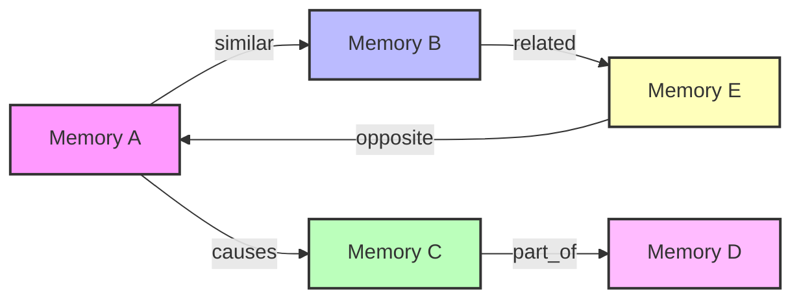
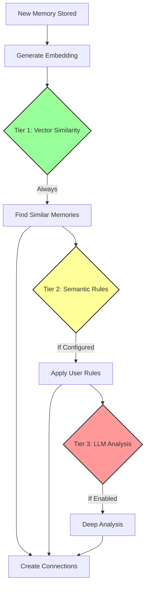
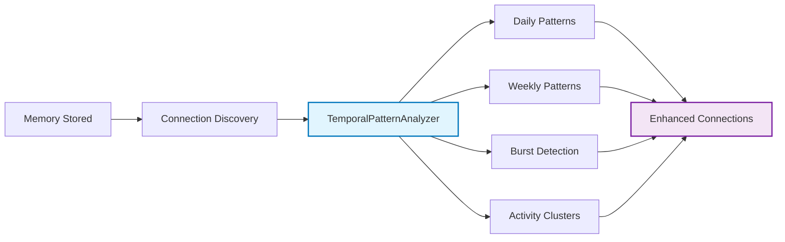

# Memory Connections

> See also: [Memory System README](./README.md) | [Graph Architecture](./graph-architecture.md)

Memory connections in AgentDock implement a Zettelkasten-inspired system that automatically discovers and maintains relationships between memories. This enables agents to build a semantic knowledge graph over time.

## What Are Memory Connections?

Memory connections represent relationships between different memories stored by an agent. When you store a new memory, the system automatically:

1. Analyzes its content and context
2. Finds related existing memories
3. Creates typed connections between them
4. Maintains these relationships for future retrieval

### Connection Types



| Type | Description | Example |
|------|-------------|---------|
| `similar` | Semantically similar content | "Team meeting notes" ↔ "Project sync discussion" |
| `related` | General relationship | "Customer feedback" ↔ "Product roadmap" |
| `causes` | Causal relationship | "Bug report" → "Fix deployed" |
| `part_of` | Hierarchical relationship | "Chapter summary" → "Book notes" |
| `opposite` | Conflicting information | "Sales up 20%" ↔ "Revenue declining" |

## How Connection Discovery Works

### Progressive Enhancement Approach

The system uses a three-tier approach to discover connections:



1. **Embedding Similarity** (Always Active)
   - Generates vector embeddings for semantic similarity
   - Compares against recent memories
   - Zero additional cost

2. **Semantic Rules** (Optional)
   - User-defined patterns in natural language
   - No regex required - uses semantic understanding
   - Examples: "Connect all memories about meetings", "Link bug reports to fixes"

3. **LLM Enhancement** (Optional)
   - Deeper semantic analysis for complex relationships
   - Cost-aware with configurable budgets
   - Discovers non-obvious connections

### Temporal Pattern Integration

When enabled, the system uses the **TemporalPatternAnalyzer** to analyze memory access patterns and enhance connection discovery:



**Temporal Features:**

1. **Pattern Detection** (`analyzePatterns()` method):
   - **Daily patterns**: Identifies regular time-based activities (e.g., "morning standup notes")
   - **Weekly patterns**: Detects recurring weekly behaviors (e.g., "Monday planning sessions")
   - **Monthly patterns**: Discovers monthly cycles (e.g., "end-of-month reports")
   - **Burst patterns**: Finds periods of intense activity

2. **Activity Cluster Detection** (`detectActivityClusters()` method):
   - Groups memories created in temporal proximity
   - Identifies focused work sessions
   - Calculates cluster intensity based on memory density
   - Provides context for time-sensitive information

3. **Statistical Analysis** (no external API calls):
   - Peak hour detection using local CPU computation
   - Frequency analysis through memory timestamp processing
   - Time-gap clustering with configurable windows
   - Progressive enhancement with optional LLM insights
   - **Resource usage**: Database queries + CPU cycles + memory allocation

**Configuration:**
```typescript
temporal: {
  enabled: true,
  analysisFrequency: 'realtime',    // realtime | hourly | daily
  minMemoriesForAnalysis: 5,        // Minimum memories needed
  enableLLMEnhancement: false       // Use LLM for deeper insights
}
```

**Implementation Example:**
```typescript
// The TemporalPatternAnalyzer in action
const patterns = await analyzer.analyzePatterns('agent-123', {
  start: new Date('2024-01-01'),
  end: new Date('2024-01-31')
});

// Returns patterns like:
[
  {
    pattern: 'daily',
    description: 'Morning activity spike 8-10 AM',
    confidence: 0.92,
    peakHour: 9
  },
  {
    pattern: 'weekly',
    description: 'Monday planning sessions',
    confidence: 0.85,
    dayOfWeek: 1
  }
]

// Activity clusters provide grouping context
const clusters = await analyzer.detectActivityClusters('agent-123');
// Returns temporally grouped memories with intensity scores
```

**Benefits:**
- Stronger connections between temporally related activities
- Better context for time-sensitive information
- Improved recall for sequential workflows
- Enhanced pattern recognition across time periods
- Behavioral insights for agent optimization

**Resource Considerations:**
- **Database load**: Queries to fetch memories within time ranges
- **CPU usage**: Statistical calculations on timestamps
- **Memory usage**: Loading and processing memory arrays
- **Optional LLM costs**: If enhancement is enabled
- **Performance impact**: Analysis runs asynchronously to avoid blocking

## How It Works Under the Hood

AgentDock uses a **hybrid SQL + in-memory graph approach** that provides graph-like functionality without requiring a separate graph database. This means:

- **No additional infrastructure** - Works with your existing PostgreSQL or SQLite database
- **Fast performance** - Optimized for typical agent workloads (100-10,000 memories)
- **Simple operations** - Standard SQL with smart caching for complex queries
- **Cost effective** - No specialized database licensing or operational overhead

For technical details about our graph architecture and implementation decisions, see our [Graph Architecture Documentation](./graph-architecture.md).

## Performance Characteristics

### Connection Discovery
- **New memory stored**: ~50ms
- **Embedding generation**: ~20ms
- **Finding similar memories**: ~30ms
- **Creating connections**: ~10ms
- **Total overhead**: ~110ms per memory

### Connection Traversal
- **Direct connections**: <10ms
- **2-hop traversal**: <50ms
- **3-hop traversal**: <100ms
- **Full subgraph load**: <200ms

### Scale Limits
- **Optimal**: 50-100 connections analyzed per memory
- **Maximum**: 500 connections per memory
- **Traversal depth**: Best at 1-3 hops

## Complete Configuration Reference

All memory connection options with defaults and descriptions:

```typescript
const memoryConfig = {
    intelligence: {
        // Base embedding layer (always enabled)
        embedding: {
            enabled: true,
            similarityThreshold: 0.7,      // Minimum similarity for connections
            model: 'text-embedding-3-small' // Embedding model to use
        },
        
        // Connection discovery configuration  
        connectionDetection: {
            method: 'hybrid',              // embedding-only | user-rules | small-llm | hybrid
            
            // ✅ Now configurable (was hardcoded at 50)
            maxRecentMemories: 50,         // Range: 10-500, how many memories to compare
            temporalWindowDays: 7,         // Range: 1-365, temporal analysis window
            enableTemporalAnalysis: false, // Use temporal patterns for connections
            
            // User-defined semantic rules (no regex patterns)
            userRules: {
                enabled: true,
                patterns: [
                    {
                        id: "meeting-notes",
                        name: "Meeting Notes",
                        description: "Connect meeting and discussion memories",
                        semanticDescription: "Connect all memories about meetings and discussions",
                        connectionType: "related",
                        confidence: 0.8,
                        semanticThreshold: 0.75,     // Embedding similarity threshold
                        requiresBothMemories: true,  // Must match both memories vs either
                        enabled: true,
                        createdBy: "user",
                        createdAt: new Date()
                    }
                ]
            },
            
            // Optional LLM enhancement for deeper analysis
            llmEnhancement: {
                enabled: false,            // Cost-aware LLM analysis
                provider: 'openai',        // anthropic | openai | etc.
                model: 'gpt-4o-mini',      // Small, fast model recommended
                apiKey: process.env.OPENAI_API_KEY,
                maxTokensPerAnalysis: 500,
                temperature: 0.2,          // Low temperature for consistency
                costPerToken: 0.0000002,   // Configure based on your provider
                costPerOperation: 0.001    // Alternative: flat rate per analysis
            }
        },
        
        // ✅ New: Temporal pattern analysis
        temporal: {
            enabled: false,              // Enable temporal pattern analysis  
            analysisFrequency: 'realtime', // realtime | hourly | daily
            minMemoriesForAnalysis: 5,   // Minimum memories needed for patterns
            enableLLMEnhancement: false  // Use LLM for deeper temporal insights
        },
        
        // ✅ New: Memory recall configuration  
        recall: {
            defaultLimit: 20,            // Range: 5-100, default memories returned
            productionLimit: 15,         // Production preset default
            minRelevanceThreshold: 0.1,  // Minimum relevance score
            enableCaching: true,         // Cache recall results
            cacheTTL: 300000            // 5 minutes cache TTL
        },
        
        // Cost control and performance
        costControl: {
            maxLLMCallsPerBatch: 10,     // Limit LLM usage per batch
            monthlyBudget: 50,           // Monthly budget in USD
            preferEmbeddingWhenSimilar: true, // Skip LLM if embedding > 0.9
            trackTokenUsage: true        // Monitor token consumption
        }
    }
};
```

### Configuration Examples

**Embedding-Based Discovery:**
```typescript
connectionDetection: {
    method: 'embedding-only',
    maxRecentMemories: 30,
    llmEnhancement: { enabled: false }
}
```

**Balanced (Hybrid Approach):**
```typescript
connectionDetection: {
    method: 'hybrid',
    maxRecentMemories: 50,
    userRules: { enabled: true },
    llmEnhancement: { 
        enabled: true,
        monthlyBudget: 10.00 
    }
}
```

**Enterprise (Full Features):**
```typescript
connectionDetection: {
    method: 'hybrid',
    maxRecentMemories: 100,
    enableTemporalAnalysis: true
},
temporal: {
    enabled: true,
    analysisFrequency: 'realtime'
},
recall: {
    defaultLimit: 25,
    enableCaching: true
}
```

## Best Practices

### 1. Connection Limits
- Keep `maxRecentMemories` between 20-100
- Higher values increase quality but add latency
- Use similarity threshold to filter weak connections

### 2. Semantic Rules
- Write rules in natural language
- Focus on your domain-specific patterns
- Test rules with sample memories

### 3. Performance Optimization
- Enable temporal pattern analysis for time-based connections
- Use background processing for non-critical connections
- Periodically prune weak connections

## Summary

AgentDock's memory connections provide powerful knowledge graph capabilities without the complexity of a dedicated graph database. By leveraging SQL's recursive queries and selective in-memory processing, we achieve:

- **Simple operations** that work with existing databases
- **Excellent performance** for typical agent workloads  
- **Flexible querying** combining vector search with graph traversal
- **Low operational overhead** using familiar tools and services

This pragmatic approach delivers the benefits of connected knowledge while maintaining the simplicity and reliability that production systems require.

These memory connections enhance AgentDock's **Conversational RAG** capabilities by providing graph-like memory relationships during retrieval. For complete RAG implementation details, see [Conversational RAG Guide](./retrieval-augmented-generation.md).