# Advanced Memory Systems for AI Agents

**Status**: 🔄 In Progress  
**Priority**: High  
**Complexity**: High  
**Target**: Q2 2025

## Overview

Modern AI agents in 2025 are implementing human-like memory systems that intelligently manage context, prioritize information, and adapt to user patterns. With larger context windows (100k+ tokens), the focus shifts from storage to intelligent selection and vertical-specific optimizations.

## The Evolution of AI Memory

### From Vector Storage to Cognitive Architecture

Traditional approaches relied heavily on vector databases for semantic search. While useful, they lack the nuance of human memory:

- **Old Approach**: Store everything, retrieve by similarity
- **New Approach**: Selective retention, importance-based recall, temporal awareness

```mermaid
graph TD
    subgraph "Traditional Memory"
        A1[User Input] --> B1[Vector Embedding]
        B1 --> C1[Store Everything]
        C1 --> D1[Similarity Search]
        D1 --> E1[Retrieve Top-K]
    end
    
    subgraph "Advanced Memory 2025"
        A2[User Input] --> B2[Multi-Modal Analysis]
        B2 --> C2[Importance Scoring]
        C2 --> D2[Selective Storage]
        D2 --> E2[Context-Aware Retrieval]
        E2 --> F2[Dynamic Consolidation]
    end
    
    style C2 fill:#f9f,stroke:#333,stroke-width:2px
    style F2 fill:#9ff,stroke:#333,stroke-width:2px
```



## Vertical-Specific Memory Approaches

Leading companies like OpenAI and Anthropic demonstrate that vertical approaches work best. Here's how memory should adapt to specific use cases:

### 1. Therapist/Counselor Agents

```typescript
interface TherapistMemory {
  // Emotional trajectory tracking
  emotionalStates: EmotionalEvent[];
  
  // Session continuity
  sessionNotes: SessionSummary[];
  recurringThemes: Theme[];
  
  // Progress tracking
  copingStrategies: Strategy[];
  breakthroughs: Insight[];
  
  // Privacy-first design
  encryption: 'AES-256';
  retention: '1-year-max';
}
```

**Key Features:**
- Emotional pattern recognition
- Session-to-session continuity
- Progress visualization
- Maximum privacy protection

### 2. Legal Assistant Agents

```typescript
interface LegalMemory {
  // Case context
  caseHistory: CaseFile[];
  relevantStatutes: Law[];
  
  // Document tracking
  filedDocuments: Document[];
  deadlines: Deadline[];
  
  // Precedent matching
  similarCases: Precedent[];
  
  // Audit trail
  allInteractions: AuditLog[];
}
```

**Key Features:**
- Complete audit trails
- Precedent pattern matching
- Deadline awareness
- Document version control

### 3. Educational Tutor Agents

```typescript
interface TutorMemory {
  // Learning progress
  conceptsMastered: Concept[];
  strugglingAreas: Topic[];
  
  // Personalization
  learningStyle: LearningProfile;
  preferredExamples: Example[];
  
  // Performance tracking
  assessmentHistory: Assessment[];
  improvementRate: number;
}
```

**Key Features:**
- Adaptive learning paths
- Concept mastery tracking
- Learning style adaptation
- Progress analytics

### 4. Personal Assistant Agents

```typescript
interface AssistantMemory {
  // User preferences
  preferences: PreferenceMap;
  routines: DailyRoutine[];
  
  // Context awareness
  currentProjects: Project[];
  upcomingEvents: Event[];
  
  // Proactive support
  anticipatedNeeds: Prediction[];
  reminders: Reminder[];
}
```

**Key Features:**
- Habit learning
- Proactive suggestions
- Context switching
- Multi-project awareness

## Human-Like Memory Patterns

### Working Memory (Immediate Context)
- **Capacity**: Limited to current task focus
- **Duration**: Seconds to minutes
- **Implementation**: Direct context window management

### Episodic Memory (Personal Experiences)
- **Capacity**: Selective retention based on importance
- **Duration**: Can persist indefinitely if reinforced
- **Implementation**: Chronological storage with emotional weighting

### Semantic Memory (Facts and Knowledge)
- **Capacity**: Large, organized by domain
- **Duration**: Permanent until contradicted
- **Implementation**: Graph-based knowledge representation

### Procedural Memory (Skills and Patterns)
- **Capacity**: Grows with successful interactions
- **Duration**: Strengthens with repeated success
- **Implementation**: Pattern extraction from outcomes

## Importance-Based Retention

Not all information deserves equal memory allocation:

```typescript
function calculateMemoryImportance(
  memory: Memory,
  context: VerticalContext
): number {
  // Base factors
  const baseScore = {
    emotionalSalience: detectEmotionalWeight(memory),
    userEmphasis: checkExplicitImportance(memory),
    repetition: memory.mentionCount / 10,
    recency: 1 / (1 + daysSince(memory.timestamp)),
    utility: memory.accessFrequency / totalAccesses,
  };
  
  // Vertical-specific weighting
  const weights = getVerticalWeights(context.vertical);
  
  return calculateWeightedScore(baseScore, weights);
}
```

## Smart Truncation for Large Contexts

With 100k+ token windows, the challenge isn't fitting everything but selecting the right content:

### 1. Progressive Summarization
```typescript
class ProgressiveSummarizer {
  summarize(messages: Message[], budget: TokenBudget): Summary {
    // Keep recent messages verbatim
    const recent = messages.slice(-10);
    
    // Summarize middle messages by importance
    const middle = messages.slice(10, -10)
      .filter(m => m.importance > threshold)
      .map(m => this.extractKeyPoints(m));
    
    // Preserve critical early context
    const early = messages.slice(0, 10)
      .filter(m => m.establishesContext)
      .map(m => this.minimalSummary(m));
    
    return this.combine(early, middle, recent, budget);
  }
}
```

### 2. Vertical-Specific Context Selection
```typescript
class VerticalContextManager {
  selectContext(vertical: Vertical, available: Memory[]): Context {
    switch(vertical) {
      case 'therapy':
        // Prioritize emotional continuity
        return this.selectTherapyContext(available);
        
      case 'legal':
        // Prioritize precedent and facts
        return this.selectLegalContext(available);
        
      case 'education':
        // Prioritize learning progression
        return this.selectEducationContext(available);
        
      default:
        // Balanced selection
        return this.selectBalancedContext(available);
    }
  }
}
```

## Implementation Patterns

### Memory-Augmented Agent Architecture

```typescript
class VerticalMemoryAgent {
  constructor(
    private vertical: Vertical,
    private storage: StorageProvider
  ) {
    this.memoryConfig = getVerticalMemoryConfig(vertical);
  }
  
  async processQuery(query: string, sessionId: string): Promise<Response> {
    // Load vertical-specific context
    const context = await this.loadVerticalContext(query, sessionId);
    
    // Generate with appropriate memory
    const response = await this.llm.generate({
      query,
      context: this.formatForVertical(context),
      instructions: this.getVerticalInstructions()
    });
    
    // Update memory based on vertical needs
    await this.updateVerticalMemory(query, response, sessionId);
    
    return response;
  }
}
```

## Performance Considerations

### Storage Backend Selection

For character.ai style applications:

```typescript
// Development
const devStorage = {
  provider: 'sqlite',
  benefits: [
    'Zero configuration',
    'Single file persistence',
    'Easy backup/restore',
    'Perfect for prototyping'
  ]
};

// Production
const prodStorage = {
  sessions: 'redis',      // Fast state access
  messages: 'postgresql', // ACID compliance
  embeddings: 'pgvector', // Semantic search
  benefits: [
    'Horizontal scaling',
    'High availability',
    'Advanced querying',
    'Supabase integration'
  ]
};
```

### Optimization Strategies

1. **Lazy Loading**: Load only memory types needed for current vertical
2. **Smart Caching**: Keep frequently accessed memories in Redis
3. **Batch Processing**: Consolidate memories during off-peak times
4. **Selective Indexing**: Index based on vertical access patterns

## Future Directions

### Context Window Evolution
As context windows grow (100k → 1M tokens), memory systems will evolve:
- Less emphasis on compression
- More emphasis on organization
- Quality over quantity selection
- Vertical-specific relevance scoring

### Multi-Agent Memory
- Shared knowledge bases per vertical
- Privacy-preserving aggregation
- Collective learning from all users
- Vertical-specific insights

## Implementation Roadmap

### Phase 1: Foundation (Q2 2025)
- [x] Storage abstraction layer
- [ ] Basic memory types implementation
- [ ] Vertical configuration system
- [ ] Simple importance scoring

### Phase 2: Vertical Optimization (Q3 2025)
- [ ] Therapy agent memory
- [ ] Legal agent memory
- [ ] Education agent memory
- [ ] Personal assistant memory

### Phase 3: Advanced Features (Q4 2025)
- [ ] Progressive summarization
- [ ] Smart context selection
- [ ] Performance benchmarks
- [ ] Production optimizations

### Phase 4: Next Generation (2026)
- [ ] Multi-agent knowledge sharing
- [ ] Advanced vertical patterns
- [ ] Automated memory evolution 