# Storage Abstraction Layer

The Storage Abstraction Layer provides a flexible system for storing and retrieving different types of data (Key-Value, Vector, etc.) using pluggable storage providers configured independently based on purpose.

## Current Status

**Status: Complete (Production Testing TBD)**

The storage abstraction layer has been fully implemented with 14 total adapters covering key-value, document, object, and vector storage needs. All planned adapters are complete, but production validation is ongoing for newer adapters.

## Feature Overview

The Storage Abstraction Layer provides:

- **Multiple Storage Types**: Distinct handling and configuration for Key-Value, Vector, and potentially Relational storage needs.
- **Purpose-Specific Configuration**: Environment variables (e.g., `KV_STORE_PROVIDER`, `VECTOR_STORE_PROVIDER`) allow selecting the right backend for each storage type.
- **Standard Provider Interfaces**: Consistent interfaces for different storage types (e.g., `StorageProvider`, `VectorStorageProvider`).
- **Pluggable Backends**: Support for various storage systems (Memory, Redis, Vercel KV, SQLite, PostgreSQL, and more).
- **Data Serialization**: Consistent handling of data.
- **Namespace Support**: Isolated storage spaces.
- **TTL Support**: For key-value stores requiring data expiration.
- **Secure Client-Side Storage**: A dedicated `SecureStorage` class for browser environments.

## Architecture Diagrams

### Core Provider Architecture

```mermaid
graph TD
    A[Application] --> B(Storage Factory)
    B --> C{Provider Interface}
    
    C --> D[Memory Provider ✓]
    C --> E[SQLite Provider ✓ - Default]
    C --> F[Redis Provider ✓]
    C --> G[Vercel KV Provider ✓]
    C --> H[PostgreSQL Provider ✓]
    C --> I[MongoDB Provider ✓]
    C --> J[S3 Provider ✓]
    C --> K[DynamoDB Provider ✓]
    C --> L[Cloudflare KV/D1 ✓]
    C --> M[Vector DBs ✓]

    subgraph ClientSide [Client-Side]
        N[Secure Storage ✓]
    end

    style B fill:#0066cc,color:#ffffff,stroke:#0033cc
    style C fill:#0066cc,color:#ffffff,stroke:#0033cc
    style E fill:#66cc66,color:#ffffff,stroke:#339933
    style N fill:#e6f2ff,stroke:#99ccff
```



### Storage Types Managed


## Configuration

Storage providers are configured via environment variables specific to their purpose:

- **`KV_STORE_PROVIDER`**: Selects the backend for general key-value storage (sessions, config). Options: `memory`, `sqlite` (default), `redis`, `vercel-kv`, `postgresql`, `mongodb`.
- **`VECTOR_STORE_PROVIDER`**: Selects the backend for vector embeddings. Options: `memory`, `pgvector`, `mongodb-atlas`, `pinecone`, `qdrant`, etc.
- **Provider-Specific Variables**: Additional variables like `REDIS_URL`, `POSTGRES_URL`, `MONGODB_URI` are used based on the selected providers.

This allows mixing backends, e.g., using SQLite for local development and PostgreSQL for production.

## Implemented Components

The following components are currently implemented:

- **Storage Provider Interface**: The `StorageProvider` interface for KV operations.
- **Base Storage Adapter**: Abstract class with common utilities (key management, serialization, TTL).
- **Memory Provider**: In-memory store for development and testing.
- **SQLite Provider**: Default zero-config local storage with file persistence.
- **PostgreSQL Provider**: Production-ready with connection pooling and transactions.
- **MongoDB Provider**: Document storage with native TTL support.
- **Redis Provider**: High-performance distributed caching.
- **Vercel KV Provider**: Serverless Redis-compatible storage.
- **S3 Provider**: Large object storage with presigned URLs.
- **Cloudflare KV Provider**: Edge key-value storage.
- **Cloudflare D1 Provider**: Edge SQL database.
- **Vector Providers**: PostgreSQL Vector, Pinecone, Qdrant, ChromaDB.
- **Secure Storage**: Client-side encrypted storage using Web Crypto API.
- **Storage Factory**: Handles instantiation of configured providers.
- **Common Utilities**: Shared components for all adapters:
  - Key management (namespaces, transformers)
  - Serialization (JSON, type-safe)
  - Error handling (unified error types)
  - Connection pooling
  - Transaction management
  - TTL management with cleanup
  - Validation utilities
  - Retry logic with exponential backoff

## Available Providers

### Key-Value Storage
| Provider | Status | Notes |
|----------|--------|-------|
| Memory | ✅ Complete | In-memory storage for testing |
| Redis | ✅ Complete | Using ioredis |
| Vercel KV | ✅ Complete | Serverless Redis |
| SQLite | ✅ Complete | Default for OSS, zero-config |
| PostgreSQL | ✅ Complete | Production-ready with pooling |
| MongoDB | ✅ Complete | Document storage with TTL |
| S3 | ✅ Complete | Large object storage |
| DynamoDB | ✅ Complete | AWS serverless NoSQL database |
| Cloudflare KV | ✅ Complete | Edge computing |
| Cloudflare D1 | ✅ Complete | Edge SQL |

### Vector Storage
| Provider | Status | Notes |
|----------|--------|-------|
| PostgreSQL Vector | ✅ Complete | pgvector extension |
| Pinecone | ✅ Complete | Managed vector search |
| Qdrant | ✅ Complete | Open-source vector DB |
| ChromaDB | ✅ Complete | Open-source embeddings DB |

## Integration Points

The Storage Abstraction Layer integrates with several key components:

- **Session Management**: For storing session state and history
- **Configuration Service**: For storing and retrieving API keys and user preferences
- **Tool Context**: For maintaining tool-specific state between calls
- **Memory Systems**: For storing long-term memory and context
- **RAG Systems**: For vector storage and retrieval

## Benefits

This abstraction layer delivers several important benefits:

1. **Flexibility**: Easily switch storage backends based on your deployment needs
2. **Scalability**: Use distributed storage systems for high-scale deployments
3. **Simplicity**: Consistent interface regardless of the underlying storage
4. **Security**: Proper handling of sensitive data with encryption
5. **Performance**: Optimize storage based on access patterns and requirements
6. **Zero Configuration**: SQLite as default means no setup required for local development

## Usage Example

```typescript
import { getStorageFactory } from '@agentdock/core';

// Default (SQLite) - Zero configuration needed
const storage = getStorageFactory().getDefaultProvider();

// Or specify a provider
const pgStorage = getStorageFactory().getProvider({
  type: 'postgresql',
  namespace: 'my-app',
  config: {
    connectionString: process.env.DATABASE_URL
  }
});

// Basic operations
await storage.set('key', { data: 'value' });
const value = await storage.get('key');
await storage.delete('key');

// With TTL
await storage.set('session', { user: 'alice' }, { ttlSeconds: 3600 });

// Batch operations
await storage.setMany({
  'user:1': { name: 'Alice' },
  'user:2': { name: 'Bob' }
});

// List operations
await storage.saveList('messages', ['Hello', 'World']);
const messages = await storage.getList('messages', 0, 10);
```

## Testing

A comprehensive test suite validates all adapters against real-world scenarios:

```bash
# Test default adapters (Memory, SQLite)
npx tsx test-storage.ts

# Test with PostgreSQL
export DATABASE_URL="postgresql://..."
npx tsx test-storage.ts
```

Tests cover:
- Basic KV operations
- Thread/conversation storage
- Multi-tenant namespace isolation
- Session management with TTL
- User agent/character listings
- Batch operations
- Concurrent access patterns

## Production Considerations

- **SQLite**: Excellent for single-server deployments, can handle thousands of requests/second
- **PostgreSQL**: Recommended for multi-server deployments requiring consistency
- **MongoDB**: Good for flexible schemas and native TTL support
- **Vector DBs**: Currently experimental, need production validation
- **S3**: Great for large files but higher latency than KV stores
- **Edge providers**: Cloudflare KV/D1 ideal for global distribution

**Note**: While core functionality is complete, production testing for newer adapters (S3, MongoDB, Vector DBs, Cloudflare) is ongoing. We recommend thorough testing in your specific use case before production deployment.

## Timeline

| Phase                     | Status      | Description                                      |
| :------------------------ | :---------- | :----------------------------------------------- |
| Core Interface            | ✅ Complete | Base interface for storage operations defined    |
| Base Adapter             | ✅ Complete | Abstract class with common utilities             |
| Memory Provider           | ✅ Complete | In-memory implementation                         |
| Redis Provider            | ✅ Complete | Distributed storage with Redis/Upstash           |
| Vercel KV Provider        | ✅ Complete | Native Vercel KV integration                     |
| Secure Storage            | ✅ Complete | Client-side secure storage implementation        |
| SQLite Provider           | ✅ Complete | Default local storage provider                   |
| PostgreSQL Provider       | ✅ Complete | Production database integration                  |
| MongoDB Provider          | ✅ Complete | Document store integration                       |
| S3 Provider              | ✅ Complete | Large object storage                             |
| Cloudflare Providers     | ✅ Complete | KV and D1 edge storage                          |
| Vector Interface          | ✅ Complete | Interface definition for Vector operations       |
| Vector Providers          | ✅ Complete | pgvector, Pinecone, Qdrant, ChromaDB           |
| Common Utilities         | ✅ Complete | Shared components for all adapters              |
| Comprehensive Testing    | ✅ Complete | Test suite for all adapters                     |
| DynamoDB Provider        | ✅ Complete | AWS serverless storage                          |
| Production Testing       | 🚧 Ongoing  | Real-world validation                           |

## Connection to Other Roadmap Items

The Storage Abstraction Layer is a foundation for several other roadmap items:

- **Advanced Memory Systems**: Relies on storage for persistent memory
- **Vector Storage Integration**: Uses the storage abstraction for vector data
- **Multi-Agent Collaboration**: Requires shared storage for coordination
- **Platform Integration**: Storage for platform-specific data

## Documentation

Comprehensive documentation is available:

- Implementation Guide: `agentdock-core/src/storage/README.md`
- API Reference: See TypeScript definitions in `agentdock-core/src/storage/types.ts`
- Testing Guide: Run `npx tsx test-storage.ts` for examples
- Best practices for different deployment scenarios
- Migration guides for upgrading from older versions 